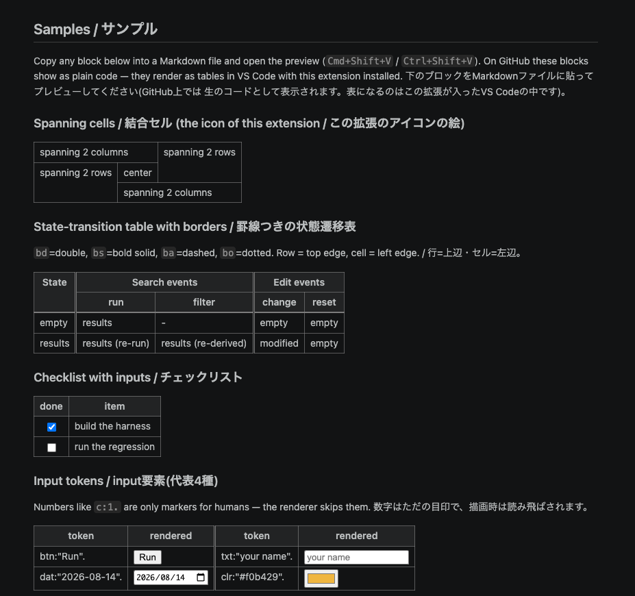

# Koushi: Markdown Spanning Table

Write tables with **merged cells** (colspan / rowspan) as Markdown-style bullet lists —
and see them rendered in VS Code's built-in Markdown preview.

Standard Markdown tables cannot express merged cells, nested tables, or border styles.
Koushi (格子, "lattice") is a tiny notation that keeps the writing feel of Markdown
bullet lists while giving you all of that.

```koushi
- t:1.
  - r:1.
    - c:1:xc2. spanning 2 columns
    - c:3:xr2. spanning 2 rows
  - r:2.
    - c:1:xr2. spanning 2 rows
    - c:2. center
  - r:3.
    - c:2:xc2. spanning 2 columns
```

The icon of this extension is exactly this table.

Here is what the Samples chapter below looks like in the VS Code preview
(下の「Samples / サンプル」章をVS Codeでプレビューした実際の見た目です):



## Quick start

1. Install the **Koushi: Markdown Spanning Table** extension.
2. In any Markdown file, write a fenced code block with the language `koushi`.
3. Open the Markdown preview (`Cmd+Shift+V` / `Ctrl+Shift+V`). The fence is rendered
   as a table. All other fences (js, python, ...) are untouched.

```koushi
- t:1.
  - r:1:h.
    - c:1. Feature
    - c:2. Markdown table
    - c:3. Koushi
  - r:2.
    - c:1. Merged cells
    - c:2:c. -
    - c:3:c. xc / xr
  - r:3.
    - c:1. Border styles
    - c:2:c. -
    - c:3:c. bd / bs / ba / bo
  - r:4.
    - c:1. Nested tables
    - c:2:c. -
    - c:3:c. t: inside a cell
```

## Notation

A table is a three-level bullet list. Every structural token ends with a period.

| Token | Meaning |
|---|---|
| `t:1.` | table |
| `r:1.` | row (child of `t:`) |
| `c:1.` | cell (child of `r:`); inline text after the period is the cell content |

**The numbers are only markers for humans.** `c:1.` / `c:2.` help you keep track of
column positions in a wide table, but the renderer skips them entirely — renumbering
never changes the output (guaranteed by golden tests).

Attributes are appended with `:` in any order:

| Attribute | On | Meaning |
|---|---|---|
| `xc2`, `xc3`, ... | cell | span N columns (colspan) |
| `xr2`, `xr3`, ... | cell | span N rows (rowspan) |
| `h` | row / cell | header (`th`) — on a row it applies to every cell in the row |
| `l` / `c` / `r` | cell | horizontal alignment: left / center / right |
| `t` / `m` / `b` | cell | vertical alignment: top / middle / bottom |
| `bd` / `bs` / `ba` / `bo` | row / cell | border style: double / bold solid / dashed / dotted |

Border rule — easy to remember: **on a row it styles the row's top edge; on a cell it
styles the cell's left edge.** The default grid is a thin solid line.

Cell content can also be child bullets: plain lines, nested lists, a nested `t:` table,
or input tokens.

## Input tokens (22 kinds)

Write them as child bullets of a cell, e.g. `- chb:on.`. Values are quoted with `"`
(escape as `\"`). Useful for UI mockups and checklists.

| Token | type | `"value"` meaning | Token | type | `"value"` meaning |
|---|---|---|---|---|---|
| `btn` | button | value | `pwd` | password | value |
| `chb` | checkbox | `on` = checked | `rad` | radio | `on` = checked |
| `clr` | color | value (#rrggbb) | `rng` | range | value |
| `dat` | date | value | `rst` | reset | value |
| `dtl` | datetime-local | value | `sch` | search | value |
| `eml` | email | placeholder | `smt` | submit | value |
| `fil` | file | `multiple` | `tel` | tel | placeholder |
| `hdn` | hidden | value | `txt` | text | placeholder |
| `img` | image | src | `tim` | time | value |
| `mnt` | month | value | `url` | url | placeholder |
| `nmb` | number | value | `wek` | week | value |

Note: the preview is a one-way renderer — clicking a checkbox in the preview does not
write back to the file.

## Editor highlighting

Inside a ` ```koushi ` fence, `-` bullets get the same color as Markdown lists,
`t:`/`r:`/`c:` are colored as tags, attributes as attribute names, and `"values"` as
strings — with whatever theme you use.

## Development

- `koushi.js` — the renderer (no dependencies, Node/browser UMD). `koushiToHtml(text)`
  returns a `<table class="koushi">`. Emits classes only, never inline styles.
- `node koushi.test.js` — golden tests for the renderer.
- `node extension.test.js` — tests for the markdown-it plugin, grammars, and packaging.
- Unknown attributes are skipped (forward compatibility).
- Package for VS Code: `npx @vscode/vsce package`.

## License

MIT — see [LICENSE](LICENSE).

## Samples / サンプル

Copy any block below into a Markdown file and open the preview (`Cmd+Shift+V` /
`Ctrl+Shift+V`). On GitHub these blocks show as plain code — they render as tables
in VS Code with this extension installed. The screenshot near the top of this page
shows exactly these samples rendered.
下のブロックをMarkdownファイルに貼ってプレビューしてください(GitHub上では
生のコードとして表示されます。表になるのはこの拡張が入ったVS Codeの中です。
このページ冒頭のスクリーンショットが、この章の描画結果です)。

### Spanning cells / 結合セル (the icon of this extension / この拡張のアイコンの絵)

```koushi
- t:1.
  - r:1.
    - c:1:xc2. spanning 2 columns
    - c:3:xr2. spanning 2 rows
  - r:2.
    - c:1:xr2. spanning 2 rows
    - c:2:c. center
  - r:3.
    - c:2:xc2. spanning 2 columns
```

### State-transition table with borders / 罫線つきの状態遷移表

`bd`=double, `bs`=bold solid, `ba`=dashed, `bo`=dotted.
Row = top edge, cell = left edge. / 行=上辺・セル=左辺。

```koushi
- t:1.
  - r:1:h.
    - c:1:xr2. State
    - c:2:xc2:bd. Search events
    - c:4:xc2:bd. Edit events
  - r:2:h.
    - c:2:bd. run
    - c:3. filter
    - c:4:bd. change
    - c:5. reset
  - r:3:bs.
    - c:1. empty
    - c:2:bd. results
    - c:3. -
    - c:4:bd. empty
    - c:5. empty
  - r:4:ba.
    - c:1. results
    - c:2:bd. results (re-run)
    - c:3. results (re-derived)
    - c:4:bd. modified
    - c:5. empty
```

### Checklist with inputs / チェックリスト

```koushi
- t:1.
  - r:1:h.
    - c:1. done
    - c:2. item
  - r:2.
    - c:1:c.
      - chb:on.
    - c:2. build the harness
  - r:3.
    - c:1:c.
      - chb.
    - c:2. run the regression
```

### Input tokens / input要素(代表4種)

Numbers like `c:1.` are only markers for humans — the renderer skips them.
数字はただの目印で、描画時は読み飛ばされます。

```koushi
- t:1.
  - r:1:h.
    - c:1. token
    - c:2. rendered
    - c:3:bd. token
    - c:4. rendered
  - r:2.
    - c:1. btn:"Run".
    - c:2.
      - btn:"Run".
    - c:3:bd. txt:"your name".
    - c:4.
      - txt:"your name".
  - r:3.
    - c:1. dat:"2026-08-14".
    - c:2.
      - dat:"2026-08-14".
    - c:3:bd. clr:"#f0b429".
    - c:4.
      - clr:"#f0b429".
```

---

# Koushi: Markdown Spanning Table (日本語)

**結合セル**(colspan/rowspan)のある表を、Markdownの箇条書きの書き味のまま書ける
小さな記法「Koushi(格子)」と、そのVS Code拡張です。
```` ```koushi ````のコードフェンスに書くと、標準のMarkdownプレビュー(⇧⌘V)で
表として描画されます。他の言語のフェンスには一切影響しません。

## 記法

表は3層の箇条書きで、構造トークンは必ず`.`で終わります。

| トークン | 意味 |
|---|---|
| `t:1.` | 表 |
| `r:1.` | 行(`t:`の子) |
| `c:1.` | セル(`r:`の子)。`.`の後ろの文がセルの内容 |

**番号はただの目印です。** `c:1.`などの数字は、幅の広い表で人間が列位置を見失わない
ためのラベルで、描画時には読み飛ばされます(振り直しても出力は変わらないことを
ゴールデンテストで保証)。

属性は`:`区切りで順不同に付けます。

| 属性 | 付ける場所 | 意味 |
|---|---|---|
| `xc2`, `xc3`, … | セル | 横にN列結合(colspan) |
| `xr2`, `xr3`, … | セル | 縦にN行結合(rowspan) |
| `h` | 行/セル | 見出し(`th`)。行に付ければ行内の全セル |
| `l` / `c` / `r` | セル | 水平の寄せ: 左/中央/右 |
| `t` / `m` / `b` | セル | 垂直の寄せ: 上/中/下 |
| `bd` / `bs` / `ba` / `bo` | 行/セル | 罫線: 二重/太実線/破線/点線 |

罫線の覚え方: **行に付ければその行の上辺・セルに付ければそのセルの左辺**。
既定の罫線は細実線です。

セルの内容は子の箇条書きでも書けます: 素の行・入れ子リスト・入れ子の`t:`表・
input要素トークン(22種。一覧は英語章のInput tokensを参照。値は`"`括り・
エスケープは`\"`)。プレビューは片方向レンダラのため、プレビュー上の操作は
ファイルへ書き戻されません。

## 編集画面のハイライト

```` ```koushi ````フェンス内の`-`はMarkdownのリストと同じ色になり、
`t:`/`r:`/`c:`はタグの色・属性は属性の色・`"値"`は文字列の色が付きます。

## 開発

- `koushi.js` — レンダラ(依存なし・Node/ブラウザ両用)。出力はclassのみでstyleを出しません。
- `node koushi.test.js` — レンダラのゴールデンテスト。
- `node extension.test.js` — markdown-itプラグイン・文法・パッケージ構造のテスト。
- 未知の属性は読み飛ばします(前方互換)。

## ライセンス

MIT — [LICENSE](LICENSE)を参照してください。
