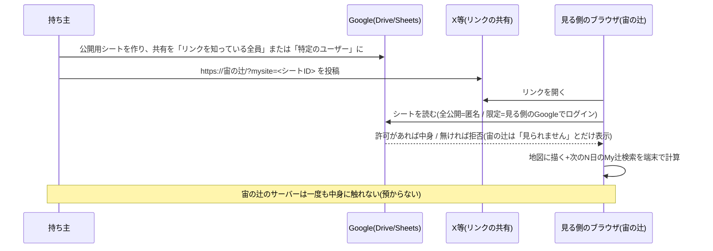

# デッサン（dessin）
-------------------------------------------------------------------------------
-------------------------------------------------------------------------------
## 推し辻サイト
-------------------------------------------------------------------------------
-------------------------------------------------------------------------------

(第2版: 2026-09-20 第143ラウンド[第144で可視マップの静的/動的の一言を更新]。依頼者の決定=**外部リンクの全廃**(ロマンス投資詐欺の未遂を受けて)と、
代わりの『ありがとう』『行った・行くよ』を反映した版。進め方も「可視マップの次に推し辻サイト」へ。
第1版[2026-09-15]=①〜⑦を背骨に。第0版[命名書と決定台帳・第139〜140]は「命名書」「決定台帳」の節に継承。
平易な言葉で書く。依頼者の言葉/AIの意見/未決は節で分ける)

### まず一言で:
- 推し辻サイトは、**「近いうちに、どの山で、いつ、どこから、推し辻(◎○)が見られるか」が日本地図で一目で
  分かり、実際に見た人の写真とレビューが集まる、投稿型の場所**です。
- 宙の辻(アプリ)が計算の道具、可視マップが土台の地図(よく見られる山は計算済み=静的、地元の山はその場で計算=動的。第144)、
  推し辻サイトが人の集まる場(投稿型)、という分担。

### 命名書(第138確定):

- 名称: **推し山サイト**
- 命名: たけちゃん(渡邊剛義・takeyosui)。2026-08-29。
- 由来(依頼者の言葉・3つ):
  1. 単純明快な分かりやすさ。
  2. `site`と`sight`を掛けて、`サイト`。(推し山が「見える(sight)」「場所(site)」)
  3. 「**推し山サイト - 推し山ダイヤモンド/推し山パール/推し山天の川の日時と場所が一目でわかるサイト**」
     というフレーズを使いやすいように、**推し山**というワードを入れた。

### 命名書:

- 名称: **推し辻サイト**
- 命名: たけちゃん(渡邊剛義・takeyosui)。2026-10-03。
- 由来(依頼者の言葉・3つ):
  1. 山だけでなくて、東京タワーなどの構造物もサポートしていたから。
  2. `site`と`sight`を掛けて、`サイト`。(推し辻が「見える(sight)」「場所(site)」)
  3. 「**推し辻サイト - 推し辻ダイヤモンド/推し辻パール/推し辻天の川の日時と場所が一目でわかるサイト**」
     というフレーズを使いやすいように、**推し辻**というワードを入れた。

### 実現したいこと(依頼者の言葉・第142・原文。第145で「共感」を「ありがとう」に言い換えた[依頼者承認]。言い換え前の原文はgit 2e6f38e):

①日本地図がバーンとあって、１〜２週間以内の百名山・二百名山・三百名山の推し辻(◎○)の位置(地図上の「島」や観測点の「ピン」)と日時(リスト)で一目で分かって、
②山を選ぶと位置（地図上の「島」や観測点の「ピン」)と2年先までの推し辻(◎○)が分かり、
さらに③観測点の「ピン」は、投稿型で、写真から取得した位置情報とその写真とレビューと評価とそのレビューに対するありがとうを投稿できる、
そして④永遠無料だから、写真とレビューと評価とありがとうは、時間と共に削除されていくけれど、レビューの参照頻度によって環境に残っていけるようにし、環境から削除される期限の３年後の日時も分かる、
また⑤参照頻度、レビュー内容、評価、ありがとうなどで、位置(地図上の「島」や観測点の「ピン」)を検索できる。
そして⑥同じユーザ(投稿者)が今までどんな観測点の「ピン」の投稿やレビューや評価やありがとうをしたか分かるリストを表示し、
⑦写真は、容量が大きいので、テキストのレビューや評価やありがとうより先に削除されるので、そのユーザがレビューの写真を再更新できるようにする。また、レビューや評価や共感は、編集して再更新できるようにする。

- ピンは登山道に配置するとしていたけれど、ピンは、ユーザによる投稿型にした(第142)。
- 「静的な」可視マップと「動的な」推し辻サイトに分けられる(第142)。

### ①〜⑦を、部品に分けて言い直すと(AIの整理):

- **地図(①②)**: 日本地図に、推し辻(◎○)がある山の**島**(可視マップから)と**ピン**(投稿から)を描く。
  上に「1〜2週間以内」のリスト。山を選ぶと、その山の島・ピンと、**2年先までの推し辻の日時**が出る。
  - 2年先の日時は、先取り計算(第140・下の台帳)で山ごとに持っておき、1〜2週間分はその切り出し。
- **ピン(③)**: ユーザーが**写真から位置を取って投稿**する観測点。写真+レビュー(文章)+評価(5パターン等)+
  ありがとう(第145: 『共感』と統合して一本に)。写真からの位置取得は、宙の辻の「写真から追加」(Exifの読み取り)がそのまま使える。
- **寿命(④⑦)**: 永遠無料を守るため、投稿は**時間で消えていく**。ただし**よく参照されるものは残る**。
  消える予定日(投稿から3年後)を表示する。**写真はテキストより先に消える**(容量が大きいため)。
  消えた写真は投稿者が**再更新**(再アップロード)できる。レビュー・評価も編集・再更新できる(ありがとうは押し直しで取消)。
- **検索(⑤)**: 参照頻度・レビューの内容・評価・ありがとうの数で、島やピンを探せる。
- **人(⑥)**: 投稿者ごとに、これまでのピン・レビュー・評価・『ありがとう』・『行った』の一覧(プロフィール)。
  プロフィールに書けるのは、ニックネーム(+システムが付ける4文字の番号)・ひとこと(100字まで)・
  プリセットから選ぶアイコン、だけ(AI案・第143)。
  **外部リンクは置かない**(第143・依頼者決定: YAMAP/ヤマレコ/X/インスタへのリンク[第136の構想]は取りやめ)。
  URL・メールアドレス・電話番号・SNSやLINEのIDは、リンクにしないだけでなく、書いた時点で弾く。
  代わりに、投稿と人に**『ありがとう』**を贈れる。贈った人と贈られた人は、お互いのプロフィールを見に行ける。
  **『行った』**(過去)は一覧に載る。**『行くよ』**(予定)は本人にしか見えない(AI案・第143)。

### 依頼者の追加(第143・原文の要旨):
- ロマンス投資詐欺に遭ってみて(被害は無し)、YAMAP/ヤマレコ/X/インスタへのリンクは無しにする。
  結局そこから詐欺の窓口を作ってしまい、一人のマンパワーでは防ぎきれない。
- プロフィールにも https:// で始まるものをリンクにしない。
- 代わりに、投稿やプロフィールに対して『ありがとう』を贈るボタン。贈った側も贈られた側もプロフィールを参照できる。
- 未来を含めて「何月何日にここに『行った・行くよ』」ボタンなど、ゆるくアピールできるものを。

### AIの意見(第142・設計の勘所):

- 賛成です。特に「静的(可視マップ)/動的(サイト)」の分離で、可視マップから「登山道の道データ」という
  権利面の課題(OSMのODbL)が消え、ピンは**人が実際に立った場所**になる — 地図より正直なデータです。
- **寿命の仕組み(④)は「参照されると延命」より「消える日を決めて、参照で更新」が作りやすい**:
  各投稿に「消える予定日(expiresAt)」を持たせ、参照されるたびに(毎回ではなく間引いて)少し先へ
  延ばす。Firestoreは日付での自動削除(TTL)を持つので、期限の管理は仕組みに任せられる。
  参照のたびに書き込むとコストが跳ねるので、**参照数は間引いて数える**(例: 10回に1回だけ加算)。
- **写真先行削除(⑦)は無料枠の守り**として理に適う: 写真(Storage)は容量で効く、テキスト(Firestore)は
  件数で効く。写真の期限をテキストより短くし(例: 1年)、期限切れ後も「再更新」ボタンを残す。
- **検索(⑤)の現実**: Firestoreは文章の全文検索が苦手。現実的には「山ごとに絞ってから、
  端末側で文章を含む検索」+「評価・ありがとう・参照頻度は並べ替え条件」。全文検索が本当に要るなら
  別サービスになるので、まずは山単位の絞り込みで始めるのが無料の道。
- **投稿型は法務とモデレーションの持ち場が増える**(第137の整理はそのまま): レビュー=公開の書き込み
  なので電気通信事業の届出は不要の方向(DMを作らない限り)。情プラ法の削除窓口(連絡先1つ)を用意。
  写真は投稿者本人の撮影のみ+利用規約で表示の許諾。通報は「自動は非表示まで・削除は人の確認」の
  二段。公開運用の前に専門家の確認を一度。
- **観測点の保護**: 1km四方の黒塗り(z15タイル整列・第138)は「公開する位置の粒度をユーザーが選べる」
  オプションとして残す(投稿型でも、点ではなく四方で公開できる)。

### AIの意見(第143・外部リンク全廃と『ありがとう』『行った・行くよ』):
- **外部リンク全廃に賛成です**。連絡先は「サイトの外へ人を連れ出す入口」になり、一人の運営では見張りきれません。
  「リンクにしない」だけでは足りません(手で打てば同じ)。守りは三段:
  ①書いた時点で弾く(全角→半角・空白と中黒を除く正規化を1回かけてから、http/https/www./「.com .jp .net」などで
  終わる語/メールアドレスの形/3文字以上の@ハンドル/電話番号の形/「LINE」「ID」+記号の並び、を弾く)
  ②サーバー側(Firestoreのルール)でも長さの上限と「http」「www.」「@」を含まない、の粗い網を掛ける
  (ブラウザ側の検証だけでは、直接書き込む相手に効かない)
  ③プロフィールの自由文を短くして「書ける場所」を小さくする(ひとこと100字・改行なし)。
  回避(「アット」「ドット」と書く・写真の中の文字やQR)は機械で追いかけず、利用規約で禁止+通報+人の目に任せます。
  弾く時の文言案: 「連絡先(URL・メールアドレス・電話番号・SNSやLINEのID)は書けません。このサイトは、連絡先の
  やり取りをしない場所にしています。『ありがとう』でつながってください。」
  全廃の範囲は「ユーザーが書く欄(プロフィール・レビュー)」。運営が載せるリンク(出典・地理院・小屋の公式)は対象外。
- **『ありがとう』は『共感』と統合して一本に(AI提案→第145・依頼者承認)**。同じ画面に二つのボタンがあると迷います。「共感」は内容への
  賛否に聞こえ、押されないことが評価のように感じられますが、「ありがとう」は人への言葉で裏返しがありません。
  数が一つになるので、④の延命と⑤の並べ替えも『ありがとうの数』で済みます。「来た時より綺麗に」の標語と同じ向き。
  形: 対象は二つ(ピンの投稿[写真+レビュー]と、人[プロフィール])。同じ相手・同じ投稿には1人1回(押し直しで取消)。
  数は「贈った人の数」。自分には贈れない。投稿への『ありがとう』は投稿と一緒に消え、人への『ありがとう』は
  アカウントと一緒に消える。
- **『ありがとう』が詐欺の入口にならないように**: 文字が無いのでモデレーションの目に掛かりにくいのが逆に弱み
  (空のアカウントで大勢に贈り、プロフィールへ誘う釣り)。守り: 1日に贈れる数の上限(例:20)。贈り主の名前が相手に
  見えるのは、贈り主に公開の投稿が1つ以上ある時だけ(空のアカウントからの分は数だけ増える)。
  「この人からは受け取らない」(ブロック)を通報とは別に用意。通報の理由に「連絡先への誘導・詐欺の疑い」を入れる。
- **『行くよ』は未来の居場所**なので、場所(山・島・ピン)のページには日付ごとの人数だけ(例「9/28 行くよ 3人」)を
  出し、誰が行くかは本人以外に見せません。日付は日まで(時刻なし)、場所は山(または島)の単位。
  『行った』(過去)は写真投稿と同じく「その日そこに居た」情報なので一覧に載せてよいが、1km黒塗りの選択を
  『行った』にも効かせる。期日を過ぎた『行くよ』は、翌日に本人へ「行きましたか?」と一度だけ聞き、『行った』に
  変える/『行けなかった』で消す。答えが無ければ7日後に自動で消す(期限付き自動削除にそのまま乗る)。
- **法務**(専門家確認が前提の見立て): 『ありがとう』『行った・行くよ』は文を含まず、ユーザーが書いた文を特定の
  相手に運ぶ機能ではないので、届出不要の方向は崩れにくい。守る線: 『ありがとう』に文やスタンプを添えられるように
  しない(添えた瞬間にDMになる)。受け取った一覧を返信できる場にしない(贈り返すのは可・文は無し)。
  『行くよ』は個人の予定なので、プライバシーポリシーに「予定は人数のみ公開・本人以外に見せない」の一文。
- **小さな守り**: ニックネームは重複を許すが、システムが付ける4文字の番号で見分ける(例「たけちゃん #7K2Q」)。
  「宙の辻」「運営」「管理」「公式」は予約語で名乗れない。サイトの目立つ場所と利用規約に一文
  「運営が、このサイトの外(メール・DM・SNS)から連絡することはありません。投資やお金の話は、すべて詐欺です。」
  登録から24時間は投稿と『ありがとう』を送れない(見るだけ)。その後も1日1投稿(memoの「1人1日1画像」)。
  アイコンは自撮りのアップロードではなくプリセット(魅力的な顔写真が詐欺の入口になるため)。
  運営の連絡先は情プラ法の削除窓口の1つだけ。ユーザー向けには通報ボタン(投稿・人)。

### 決定台帳(第138〜143の決定済み事項):

- **スコープ**: 2年先の◎○は先取り計算で持つ(下記)。カスタマイズ(天の川オフセット角・パール左右45度/
  垂直90度・線の検索中心)・公開Myリストからの推し山追加(地元の百名山を大切に)・可視判定5パターンの
  統計・観測点の1km黒塗りは推し辻サイトの持ち場。
- **先取り計算(第140・依頼者発案・AI賛成、形は実装デッサンで確定)**: 2年先の1日ずつを先取りして保管
  すれば、2週間先も2年先も同じ表から取れる。日々は+1日のローリング更新、初回だけMCPバッチで2年分。
  代表プリセット: 天の川=オフセット中心角+15°(夏の天の川を撮りたい方が多い)・パール=左右45°/垂直90°の線。
  カスタム値はユーザー自身が宙の辻で計算。◎○の「場所」まで持つとデータが膨らむので、島単位の集約など
  持ち方の圧縮を決める。
- **使用量の蛇口**: 予算アラートは使用量85%で発信。95%で投稿も参照も止め、「サイト全体の使用量の上限に
  達しました。来月○日(土)0:00より、再開予定です。」を表示。サイト内(アクセスカウンターの下)に使用量の
  状況を表示。再開日は**枠の種類ごとに出す**(Firestoreは日次・Storageの帯域は月次)。計測は自前の
  集計カウンタでの近似(月次リセットでズレの蓄積を切る)。
- **基盤**: Firebase一本化(Auth+Firestore+Hosting=無料枠・写真はStorage[Blaze・無料枠5GB/帯域100GB月])。
  料金の実測は2026-08-29(docs/order-log/order-2026-08-29.md その135)。デッサン確定前に再確認する。
- **法務の見立て**(上記AIの意見に同じ)。**モデレーション**: 「来た時より綺麗に」の標語は多言語で。
  小さく・仲間内の非公開ベータから始め、一生物の統計データの器(スキーマと規約)を先に正しく作る。
- **外部リンク全廃(第143・依頼者決定)**: ユーザーが書く欄(プロフィール・レビュー)にURL・メールアドレス・電話番号・
  SNS/LINEのIDは書けない。リンク化もしない。運営が載せるリンク(出典・地理院・小屋の公式)は対象外。
- **『ありがとう』(第143・依頼者発案。第145: 『共感』と統合して一本に=依頼者承認)**: 投稿と人に贈れる。
  贈った側・贈られた側はお互いのプロフィールを参照できる。同じ相手・同じ投稿には1人1回。文は添えない。
- **『行った・行くよ』(第143・依頼者発案)**: 日付+場所のゆるいアピール。『行くよ』は人数のみ公開・本人以外には
  見せない(AI案・依頼者の承認待ち)。期日後は本人に確認し、答えが無ければ消す。

### 進め方(第143・依頼者決定。第142の順番を変更):
- 可視マップと推し辻サイトは**デッサンまで**→可視マップの実装→**推し辻サイトの実装**→
  その後に宙断面・宙検索・宙統計・宙の会合(依頼者: 「オリジナリティは可視マップと推し辻サイト」)。

### 未決(実装デッサンで):
- 画面構成の具体(全体地図・1〜2週間リスト・山ページ・ピンの詳細・投稿フォーム・プロフィール)。
- データの形(投稿・写真・ユーザー・集計)と期限(写真/テキスト)の日数、延命の間引き率。
- 評価の形(可視判定5パターンをそのまま「評価」にするか)。
- 検索の範囲(山単位の絞り込みで始めるか)。
- ホスティング/認証/DBのサービス比較の実測(依頼者依頼・第137)。
- 可視マップ(静的資産)の受け取り方と、宙の辻本体との導線(URL・MCP)。
- (第143→第145で決定)『共感』は『ありがとう』に統合(依頼者承認。①〜⑦の言葉も言い換え済み)。
- (第143)弾く型の一覧と、弾いた時の文言(正規化の範囲)。ひとことの長さ(100字案)とアイコンのプリセットの中身。
- (第143)『ありがとう』の1日上限の数・ブロックの形・贈り主の名前が見える条件(公開投稿1つ以上、の案)。
- (第143)『行くよ』の場所の粒度(山/島/ピン)・期日後に消すまでの日数・『行った』に1km黒塗りを効かせるか。
- (第143)登録直後の待ち時間(24時間案)と1日の投稿数。

### 検討資料(第155・依頼者の依頼): 「推し山サイト(SNS)」をやめて「Myサイト」へ — サーバー無しで、どこまでできるか

依頼者の問い(2026-10-03・原文の要旨): なりすましが防げないのでSNSはやめる。代わりに、複数のMyリストを集めた「私だけのMyサイト」を日本地図でぱっと見で分かるようにし、
公開/非公開を持ち、Googleスプレッドシートの共有状態(閲覧者限定/リンクを知っている全員)で判断し、全公開なら公開期間つきで宙の辻側にキャッシュして公開リンクをXなどで共有、
リンクを知っている人が同じものを見られるように。写真家が撮影地情報で収益を得られる強固で柔軟な認証も。パスフレーズよりGoogleアカウントの閲覧権限の方が安全では?
ただし、サーバー側は作り込みたくない(ユーザーの大切な情報を預かれる開発・スキル・責任は無い)。サーバー無しのローカル側で「私の推し辻リストが近々『辻』になる」が一発で分かれば十分かも。

#### まず結論(AIの提案)
1. **宙の辻側のキャッシュ(サーバー)は持たない。** 公開/限定公開の判断と鍵は、すべて**Googleの共有機能に委ねる**。宙の辻は「見る側のブラウザがGoogleから直接読んで描く」だけにする。
   これなら、宙の辻はユーザーの情報を一切預からない(依頼者の方針と一致)。
2. **Myサイト=「公開用のMyセット(シート)の束」を1枚の日本地図に描く画面。** 持ち主は、見せたいMyリストだけを「公開用シート」に集め(今のMyセットの同期の仕組みの延長)、
   その**シートのID(またはIDの束)をURLに入れた宙の辻のリンク**を配る。見る側は、そのリンクを開くと、宙の辻が(見る側のブラウザから)シートを読んで地図に描く。
3. **公開の範囲はGoogleの共有の設定そのもの**: 「リンクを知っている全員」=誰でも見られる(全公開)。「特定のユーザー」=そのGoogleアカウントでログインした人だけ(限定公開)。
   見る側の宙の辻は、全公開なら匿名で、限定公開なら**見る側自身のGoogleログイン**(OAuth)で読む。宙の辻は持ち主の鍵を持たない。
4. **公開期間**は2段で持つ: ①持ち主がシートの共有を外す(本物の遮断)。②シートに「公開終了日」のセルを置き、宙の辻はその日を過ぎたら描かない(見た目の遮断。クライアント側なので本物の壁ではない)。
5. **写真家の有料公開**は、サーバー無しでは「支払い→閲覧権限の付与」を**Googleの共有(特定のユーザーに追加)で手作業**にするのが、いちばん安全で現実的。
   パスフレーズ方式(ブラウザで復号)は実装できるが、鍵が漏れたら止められず、復号後のデータは複製できる。「強固」をうたえるのは**Googleアカウントの権限**の方。
6. **「近々『辻』になる」を一発で**: 見る側の宙の辻が、読んだMyリスト(観測点・目的点・My辻検索の条件)で**次のN日(初期値14日)のMy辻検索を自分の端末で走らせ**、
   日本地図に「山(目的点)ごとに次の◎○の日時」のバッジを立てる。計算は見る側の端末(今のMy辻検索そのもの)なので、サーバーは要らない。

#### 何がサーバー無しで「できる/できない」か
| 要件 | サーバー無しでできるか | どうやって | 限界 |
|---|---|---|---|
| 複数のMyリストを1枚の日本地図に | ○ | 公開用シートの束をURLで指定→見る側が読んで描く | — |
| 公開/非公開 | ○ | Googleの共有設定(リンクを知っている全員/特定のユーザー/非公開) | 宙の辻は設定を変えられない(持ち主がDriveで操作) |
| 限定公開(見る人を選ぶ) | ○ | 特定のGoogleアカウントに閲覧権限→見る側は自分のGoogleでログインして読む | 見る側にもGoogleアカウントが要る |
| 公開期間 | △ | シートの「公開終了日」(見た目の壁)+持ち主が共有を外す(本物の壁) | 宙の辻だけでは強制できない |
| 公開リンクをXなどで共有 | ○ | `https://(宙の辻)/?mysite=<シートID>` の形 | シートIDはURLに見える(限定公開なら見えても読めない) |
| 「リンクを知っている人が同じものを見る」 | ○ | 同じシートを同じ宙の辻で描くので同じ画面 | 見る側の端末の計算(My辻検索)なので数秒の待ち |
| 宙の辻側でのキャッシュ | × (持たない) | — | 持たないことが安全(預からない) |
| 有料公開(収益) | △ | 支払いは外部(noteの有料記事・BOOTH・Stripeのリンク等)→持ち主がGoogleの共有に相手を追加 | 自動化はサーバーが要る。手作業で小規模なら成り立つ |
| パスフレーズで閲覧 | △ | シートに暗号文(ブラウザでAES-GCMで復号)。鍵は別経路で渡す | 鍵が漏れたら止められない。復号後は複製できる。「強固」ではない |
| なりすまし防止 | ○(SNSより強い) | 投稿が無い。見せるのは持ち主のGoogleアカウントが共有したシートだけ | 持ち主の名乗り(表示名)はシートの中身=自己申告 |
| 偽公式・フィッシング | ○ | メッセージ機能を持たない(memoの方針)。リンクは宙の辻のドメイン直下 | 偽の宙の辻ドメインは防げない(どのサイトも同じ) |

#### 流れ(Mermaid)
```mermaid
flowchart LR
  subgraph owner[持ち主の端末]
    A[Myセット(非公開)] -->|見せたい分だけ| B[公開用シート(束)]
    B -->|Googleの共有設定| C{全公開 / 限定公開}
    B -->|URLを作る| D[公開リンク https://宙の辻/?mysite=ID,ID]
  end
  D -->|X・LINE等で配る| V[見る側の端末]
  subgraph viewer[見る側の端末(宙の辻)]
    V -->|全公開: 匿名で読む / 限定: 自分のGoogleでログインして読む| G[(Googleスプレッドシート)]
    G --> H[Myサイトの地図: 観測点・目的点・島(可視マップ)]
    H --> I[次のN日のMy辻検索を端末で計算]
    I --> J[山ごとの「次の◎○」バッジ・一覧]
  end
  C -.->|権限の判定はGoogle| G
```



#### 「公開用シート」の形(案)
- 今のMyセットの同期(Googleスプレッドシート)と同じ列に、先頭にメタの行を足す: `表示名`・`ひとこと`(100字)・`公開終了日`・`含めるMyリスト`(観測点/目的点/My辻検索)・`版`。
- 1枚のシートに1つのMyセット。複数のMyセットを束ねる時はURLに複数のIDを並べる(`?mysite=ID1,ID2`)か、「束のシート」(IDの一覧だけ)を1枚作る。
- 読む側は**読み取り専用**で開く(書き戻しの経路を持たない)。

#### 認証と鍵の整理(依頼者の問い「パスフレーズよりGoogleの閲覧権限の方が安全では?」への答え)
- **Googleアカウントの閲覧権限の方が安全です。** 理由: ①鍵の配布と失効がGoogle側(持ち主がいつでも外せる) ②見る側の本人確認がGoogle(2段階認証を含む) ③宙の辻は鍵を持たない。
- パスフレーズ方式は、鍵を配った後に止める手段が無く(新しい鍵で暗号化し直して配り直すしかない)、復号後のデータは複製できる。「強固」とは言えないので、採るとしても
  「全公開の中で少しだけ隠す」(例: 代表点の位置を粗くする)用途に留める。
- 「ある期間だけ公開し、後から期間を直せる」は、持ち主が**Googleの共有の期限付きアクセス**(Google Workspaceの機能。個人アカウントでは有効期限の設定が使えない場合がある)か、
  シートの`公開終了日`を書き換える(見た目の壁)で実現する。本物の壁は共有を外すこと。
- 有料化: 支払いの受け取りは宙の辻の外(noteの有料記事にシートIDと閲覧依頼の手順を書く・BOOTH・Stripeの支払いリンク等)。持ち主は支払った人のGoogleアカウントを共有に追加する。
  小規模(数十人)なら手作業で回る。大規模や自動化はサーバー(またはGoogle Apps Script=持ち主のGoogleアカウントで動く小さなサーバー)が要る。
  Apps Scriptは「持ち主の」Googleで動くので、宙の辻の運用者がリソースを管理する話にはならない(将来の選択肢)。

#### 宙の辻側に要る実装(見積もり。順番は依頼者の判断で)
1. URLの`mysite`パラメータ(シートIDの束)→公開用シートを読む(全公開=APIキー無しの「ウェブに公開」のCSV、または Sheets API+見る側のOAuth[今のMyセット同期の認証を流用])。
2. Myサイト画面: 日本全図に、観測点(青)・目的点(赤)・My辻検索の線・可視マップの島(資産があれば)を描く。持ち主の表示名・ひとこと・公開終了日。
3. 「近々の辻」: 読んだMy辻検索の条件で次のN日を端末で計算し、目的点ごとに「次の◎○」のバッジと一覧(日時・観測点・方位)。期間の初期値14日(ユーザーが指定可)。
4. 持ち主側: 「公開用シートを作る」ボタン(今のMyセットから見せたいリストを選んで新しいシートに書き出す)+「公開リンクを作る」(IDを束ねたURL。クリップボードへ)。
5. 守り: 読む側は読み取り専用・書き戻し無し。メッセージ機能無し。表示名はシートの値をそのまま(リンク化しない。外部URLは表示しない=第143の方針)。
6. 注記(公開文): 「このMyサイトは持ち主のGoogleスプレッドシートを、あなたのブラウザが直接読んで描いています。宙の辻はその内容を保存しません。」

#### 判断をお願いしたいこと
- Q1: Myサイトの「見る側」は、全公開ならGoogleログイン無しで見られる形でよいか(=シートを「ウェブに公開」する運用になる)。
- Q2: 限定公開は「見る側が自分のGoogleでログイン」でよいか(見る側にもGoogleアカウントが要る)。
- Q3: 有料公開は「支払いは外・権限の付与はGoogleの共有で手作業」の小規模運用で始めてよいか(自動化は作らない)。
- Q4: 「近々の辻」の期間の初期値(14日案)と、地図に出すもの(観測点・目的点・線・島・バッジ)の優先順。
