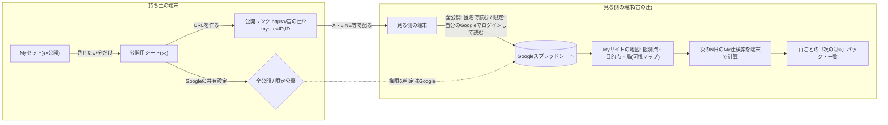
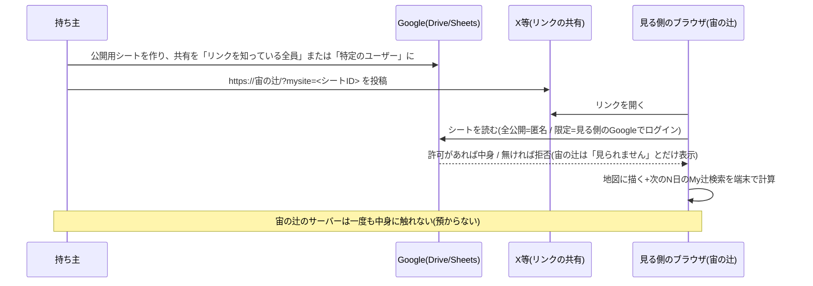

# デッサン（dessin）
-------------------------------------------------------------------------------
-------------------------------------------------------------------------------
## Myサイト
-------------------------------------------------------------------------------
-------------------------------------------------------------------------------

### まず一言で:
- Myサイトは、**「近いうちに、どの山で、いつ、どこから、推し辻(◎○)が見られるか」が日本地図で一目で分かり、他者と共有できる場所**です。

### 命名書:

- 名称: **Myサイト**
- 命名: たけちゃん(渡邊剛義・takeyosui)。2026-10-04。
- 由来(依頼者の言葉・3つ):
  1. 山だけでなくて、東京タワーなどの構造物もサポートしていたから。
  2. `site`と`sight`を掛けて、`サイト`。(推し辻が「見える(sight)」「場所(site)」)
  3. 「**Myサイト - 私の推し辻ダイヤモンド/推し辻パール/推し辻天の川の日時と場所が一目でわかるサイト**」というフレーズを使いやすいように、**推し辻**というワードを入れた。また、サイト名はユーザが任意名をつけられるようにシンプルに**My**にした。

### コンセプト

https://note.com/takeyosui/n/n302ed709d2c7

今朝、ベッドの中で、深い眠りから覚めたら、思うことがありました。
慌てて、スマホのメモにとったけれど、こんな感じでした。

どこに立ったら、何が見えるか、そして、そこから、いつ再び、何が見えるか、撮影者として、知りたいをかなえるツール。

例えば、ロケハンして、ステージが気に入ったけど、主役の天の川や月は、どう映るか、そして、いつ再び来れば良いか、を知ることができる。

大切なのは、立つ位置（客席）とロケーション（ステージ）と天体（主役）と時期（演目時間）という、演目。

辻検索は、立つ位置（客席）と山の場所（ステージ）を決めたら、いつ（演目時間）、何（主役）が見えるかを決めるためのツールでした。

辻メッシュ検索は、山の場所（ステージ）を決めたら、どの場所（客席）で、いつ（演目時間）、何（主役）が見えるかを決めるためのツールでした。

でも、正直、一つの演目（客席、ステージ、主役、演目時間）を決めるのは、私のような一般の人には難しいです。

私は、星景写真が一般の人にも楽しめるように、そして、一般の人の私でも、星景写真を楽しめるように、とツール開発をしてきました。

でも、気がついたのですが、写真家さんの知っている一つの星景写真という演目（客席、ステージ、主役、演目時間）には、価値があると。

そして、私は、写真でオリジナリティーを出したいわけではなくて、ああいう写真を私も撮ってみたいという、動機があるだけで、そういう一般の方達は、いっぱいると思いました。

そして、星景写真をもっと手軽に撮れるように普及してほしいと思いました。

その割に、星景写真を撮るためには、色々と敷居が高いです。

お金をかけて、高いカメラを買えば撮れるようになるものではありません。

なぜなら、演目（客席、ステージ、主役、演目時間）を知らないからです。

そして、演目を探すツールは、たくさんあります。

だから、私は、星景写真（演目）という、立つ位置（客席）とロケーション（ステージ）と天体（主役）と時期（演目時間）を知らない人と、知っている人を繋ぐツール、演目を知らない人と知っている人が行き交う（辻）ツールを作っていこうと思いました。

もう、その一歩は、踏み出しました。
宙の辻のMyサイトで、宙の辻の画面をサーバーレスで、全共有公開、限定共有公開、非公開が選べるものです。

限定共有公開があるのは、価値ある演目を提供していただける写真家さんを守るためです。

撮影地情報という価値ある演目を写真家さんたちが、 noteなどで、有料販売できるようにです。

星景写真（宙）という演目を知らない人と知っている人が行き交う（辻）ツール

これが、私の『宙の辻 - Sora no Tsuji』のコンセプトです。

### 検討資料(第155・依頼者の依頼): 「推し山サイト(SNS)」をやめて「Myサイト」へ — サーバー無しで、どこまでできるか

依頼者の問い(2026-10-03・原文の要旨): なりすましが防げないのでSNSはやめる。代わりに、複数のMyリストを集めた「私だけのMyサイト」を日本地図でぱっと見で分かるようにし、
公開/非公開を持ち、Googleスプレッドシートの共有状態(閲覧者限定/リンクを知っている全員)で判断し、全公開なら公開期間つきで宙の辻側にキャッシュして公開リンクをXなどで共有、
リンクを知っている人が同じものを見られるように。写真家が撮影地情報で収益を得られる強固で柔軟な認証も。パスフレーズよりGoogleアカウントの閲覧権限の方が安全では?
ただし、サーバー側は作り込みたくない(ユーザーの大切な情報を預かれる開発・スキル・責任は無い)。サーバー無しのローカル側で「私の推し辻リストが近々『辻』になる」が一発で分かれば十分かも。

#### まず結論(AIの提案)
1. **宙の辻側のキャッシュ(サーバー)は持たない。** 公開/限定公開の判断と鍵は、すべて**Googleの共有機能に委ねる**。宙の辻は「見る側のブラウザがGoogleから直接読んで描く」だけにする。
   これなら、宙の辻はユーザーの情報を一切預からない(依頼者の方針と一致)。
2. **Myサイト=「公開用のMyセット(シート)の束」を1枚の日本地図に描く画面。** 持ち主は、見せたいMyリストだけを「公開用シート」に集め(今のMyセットの同期の仕組みの延長)、
   その**シートのID(またはIDの束)をURLに入れた宙の辻のリンク**を配る。見る側は、そのリンクを開くと、宙の辻が(見る側のブラウザから)シートを読んで地図に描く。
3. **公開の範囲はGoogleの共有の設定そのもの**: 「リンクを知っている全員」=誰でも見られる(全公開)。「特定のユーザー」=そのGoogleアカウントでログインした人だけ(限定公開)。
   見る側の宙の辻は、全公開なら匿名で、限定公開なら**見る側自身のGoogleログイン**(OAuth)で読む。宙の辻は持ち主の鍵を持たない。
4. **公開期間**は2段で持つ: ①持ち主がシートの共有を外す(本物の遮断)。②シートに「公開終了日」のセルを置き、宙の辻はその日を過ぎたら描かない(見た目の遮断。クライアント側なので本物の壁ではない)。
5. **写真家の有料公開**は、サーバー無しでは「支払い→閲覧権限の付与」を**Googleの共有(特定のユーザーに追加)で手作業**にするのが、いちばん安全で現実的。
   パスフレーズ方式(ブラウザで復号)は実装できるが、鍵が漏れたら止められず、復号後のデータは複製できる。「強固」をうたえるのは**Googleアカウントの権限**の方。
6. **「近々『辻』になる」を一発で**: 見る側の宙の辻が、読んだMyリスト(観測点・目的点・My辻検索の条件)で**次のN日(初期値14日)のMy辻検索を自分の端末で走らせ**、
   日本地図に「山(目的点)ごとに次の◎○の日時」のバッジを立てる。計算は見る側の端末(今のMy辻検索そのもの)なので、サーバーは要らない。

#### 何がサーバー無しで「できる/できない」か
| 要件 | サーバー無しでできるか | どうやって | 限界 |
|---|---|---|---|
| 複数のMyリストを1枚の日本地図に | ○ | 公開用シートの束をURLで指定→見る側が読んで描く | — |
| 公開/非公開 | ○ | Googleの共有設定(リンクを知っている全員/特定のユーザー/非公開) | 宙の辻は設定を変えられない(持ち主がDriveで操作) |
| 限定公開(見る人を選ぶ) | ○ | 特定のGoogleアカウントに閲覧権限→見る側は自分のGoogleでログインして読む | 見る側にもGoogleアカウントが要る |
| 公開期間 | △ | シートの「公開終了日」(見た目の壁)+持ち主が共有を外す(本物の壁) | 宙の辻だけでは強制できない |
| 公開リンクをXなどで共有 | ○ | `https://(宙の辻)/?mysite=<シートID>` の形 | シートIDはURLに見える(限定公開なら見えても読めない) |
| 「リンクを知っている人が同じものを見る」 | ○ | 同じシートを同じ宙の辻で描くので同じ画面 | 見る側の端末の計算(My辻検索)なので数秒の待ち |
| 宙の辻側でのキャッシュ | × (持たない) | — | 持たないことが安全(預からない) |
| 有料公開(収益) | △ | 支払いは外部(noteの有料記事・BOOTH・Stripeのリンク等)→持ち主がGoogleの共有に相手を追加 | 自動化はサーバーが要る。手作業で小規模なら成り立つ |
| パスフレーズで閲覧 | △ | シートに暗号文(ブラウザでAES-GCMで復号)。鍵は別経路で渡す | 鍵が漏れたら止められない。復号後は複製できる。「強固」ではない |
| なりすまし防止 | ○(SNSより強い) | 投稿が無い。見せるのは持ち主のGoogleアカウントが共有したシートだけ | 持ち主の名乗り(表示名)はシートの中身=自己申告 |
| 偽公式・フィッシング | ○ | メッセージ機能を持たない(memoの方針)。リンクは宙の辻のドメイン直下 | 偽の宙の辻ドメインは防げない(どのサイトも同じ) |

#### 流れ(Mermaid)

#### 「公開用シート」の形(案)
- 今のMyセットの同期(Googleスプレッドシート)と同じ列に、先頭にメタの行を足す: `表示名`・`ひとこと`(100字)・`公開終了日`・`含めるMyリスト`(観測点/目的点/My辻検索)・`版`。
- 1枚のシートに1つのMyセット。複数のMyセットを束ねる時はURLに複数のIDを並べる(`?mysite=ID1,ID2`)か、「束のシート」(IDの一覧だけ)を1枚作る。
- 読む側は**読み取り専用**で開く(書き戻しの経路を持たない)。

#### 認証と鍵の整理(依頼者の問い「パスフレーズよりGoogleの閲覧権限の方が安全では?」への答え)
- **Googleアカウントの閲覧権限の方が安全です。** 理由: ①鍵の配布と失効がGoogle側(持ち主がいつでも外せる) ②見る側の本人確認がGoogle(2段階認証を含む) ③宙の辻は鍵を持たない。
- パスフレーズ方式は、鍵を配った後に止める手段が無く(新しい鍵で暗号化し直して配り直すしかない)、復号後のデータは複製できる。「強固」とは言えないので、採るとしても
  「全公開の中で少しだけ隠す」(例: 代表点の位置を粗くする)用途に留める。
- 「ある期間だけ公開し、後から期間を直せる」は、持ち主が**Googleの共有の期限付きアクセス**(Google Workspaceの機能。個人アカウントでは有効期限の設定が使えない場合がある)か、
  シートの`公開終了日`を書き換える(見た目の壁)で実現する。本物の壁は共有を外すこと。
- 有料化: 支払いの受け取りは宙の辻の外(noteの有料記事にシートIDと閲覧依頼の手順を書く・BOOTH・Stripeの支払いリンク等)。持ち主は支払った人のGoogleアカウントを共有に追加する。
  小規模(数十人)なら手作業で回る。大規模や自動化はサーバー(またはGoogle Apps Script=持ち主のGoogleアカウントで動く小さなサーバー)が要る。
  Apps Scriptは「持ち主の」Googleで動くので、宙の辻の運用者がリソースを管理する話にはならない(将来の選択肢)。

#### 宙の辻側に要る実装(見積もり。順番は依頼者の判断で)
1. URLの`mysite`パラメータ(シートIDの束)→公開用シートを読む(全公開=APIキー無しの「ウェブに公開」のCSV、または Sheets API+見る側のOAuth[今のMyセット同期の認証を流用])。
2. Myサイト画面: 日本全図に、観測点(青)・目的点(赤)・My辻検索の線・可視マップの島(資産があれば)を描く。持ち主の表示名・ひとこと・公開終了日。
3. 「近々の辻」: 読んだMy辻検索の条件で次のN日を端末で計算し、目的点ごとに「次の◎○」のバッジと一覧(日時・観測点・方位)。期間の初期値14日(ユーザーが指定可)。
4. 持ち主側: 「公開用シートを作る」ボタン(今のMyセットから見せたいリストを選んで新しいシートに書き出す)+「公開リンクを作る」(IDを束ねたURL。クリップボードへ)。
5. 守り: 読む側は読み取り専用・書き戻し無し。メッセージ機能無し。表示名はシートの値をそのまま(リンク化しない。外部URLは表示しない=第143の方針)。
6. 注記(公開文): 「このMyサイトは持ち主のGoogleスプレッドシートを、あなたのブラウザが直接読んで描いています。宙の辻はその内容を保存しません。」

#### 判断をお願いしたいこと
- Q1: Myサイトの「見る側」は、全公開ならGoogleログイン無しで見られる形でよいか(=シートを「ウェブに公開」する運用になる)。

はい、良いです。

- Q2: 限定公開は「見る側が自分のGoogleでログイン」でよいか(見る側にもGoogleアカウントが要る)。

はい、良いです。

- Q3: 有料公開は「支払いは外・権限の付与はGoogleの共有で手作業」の小規模運用で始めてよいか(自動化は作らない)。

はい、良いです。

- Q4: 「近々の辻」の期間の初期値(14日案)と、地図に出すもの(観測点・目的点・線・島・バッジ)の優先順。

画面構成の案なのですが、Myセットと同じように、既定のサイトがあり、既定のサイトには、複数のMyセットを関連づけられるようになっている。
そして、既定のサイト以外に、複数のMyサイトを持てるようになっている。
Myセットは、1つのスプレッドシートであるので、Myセットの公開非公開範囲は、Myセット単位である。
その公開されたMyセット単位で、複数のMyサイトに関連づけられる1対多の関係である。
そして、Myサイトも、Myセットと同じように、1つのスプレッドシートである。
Myサイトのスプレッドシートには、複数のシートがある。
シート①「Myセット」には、関連づける複数のMyセットのスプレッドシートの公開共有URLのリスト、Myセット単位の公開開始日付と公開終了日付、がある。
シート②「全体設定」には、Myサイト単位の公開開始日付と公開終了日付、150文字までのサイト名、推し辻検索期間
シート③「サイトバージョン」には、このサイトのシートの内容の版管理するバージョンと書き換え禁止の注意書き
できたら、Myサイトのスプレッドシートは、直接手で編集するのではなく、辻検索や辻メッシュ検索のように、リストを画面に表示して、チェックボックスで選択をするとか、日付ピッカーを行に埋め込んで、入力させるとか、サイト名も、テキストボックスを行に埋め込んで、入力をさせたいです。
そして、Myサイトを共有するときのURLは、`?mysite=ID1`で入力するID1は、公開するMyサイトのスプレッドシートの公開の共有URLを指定するだけにしたいです。
そして、できたら、`?mysite=ID1,ID2`として、複数のMyサイトを合わせて表示したり、公開前にプレビューしたり、公開されているMyサイトのURLから自分のMyサイトに取り込めたりできるようにしたいです。
ということは、MyセットやMy辻検索やMy観測点/目的点/天体は、辻検索や辻メッシュ検索のようにリスト表示のエディターが今後表示されるようになれば良いですね。
でも、多分できますね。
どれも、CSVで書き出し可能なフォーマットなので😄
いかがでしょうか。

-------------------------------------------------------------------------------
### デッサン本文(第1版・AI起草。依頼者レビュー待ち)

(この本文は、上の「検討資料」のQ1〜Q3の「はい」と、Q4の画面構成の案[既定のサイト+複数のMyサイト・Myサイトも1つのスプレッドシート・
リスト表示のエディター・`?mysite=ID1,ID2`・プレビュー・取り込み]と、その後の依頼者の問い[公開共有がSNSのようになって不正利用されないか。
サイト名150字は不可。公開者が誰か分かるようにしたいが、Googleアカウントのブロックは背負えない。どうしたら良いか]を受けて書いたもの。
依頼者の言葉/AIの意見/未決は節で分ける。平易な言葉で書く)

### まず一言で(本文版):
- Myサイトは、**持ち主のGoogleスプレッドシート(Myサイト)と、そこから指すGoogleスプレッドシート(Myセット)を、見る側のブラウザが直接読んで、
  日本地図に「どの山で・いつ・どこから・推し辻(◎○)が見られるか」を描く画面**です。
- 宙の辻は、**計算機と画用紙**に徹します。内容を保存しない・一覧にしない・検索させない・連絡させない・リンク化しない。
  だから、SNSにはなりません(下の「守り」)。公開の鍵と身元と通報は、全部**Googleの共有の仕組み**に委ねます。

### 用語(このデッサンで使う言葉):
- **Myサイト**: 1つのGoogleスプレッドシート。3つのシート(①Myセット・②全体設定・③サイトバージョン)を持つ。持ち主のDriveにある。
- **既定のサイト**: 持ち主の端末(ローカルストレージ)にある、スプレッドシートを持たないMyサイト。Myセットの「既定のセット」と同じ立場(ID:0・名前固定・常に先頭)。
- **Myセット**: 既存のMyセット(1つのGoogleスプレッドシート。My辻検索・My観測点・My目的点・My天体)。Myサイトは、公開共有されたMyセットのURLを束ねるだけで、中身は持たない。
- **公開共有URL**: Googleの共有で「リンクを知っている全員(閲覧者)」にしたスプレッドシートのURL(`https://docs.google.com/spreadsheets/d/<ID>/edit?usp=sharing`)。
  宙の辻が使うのはその中の **ID**(`/d/` と次の `/` の間の文字列)。
- **持ち主**: Myサイトのスプレッドシートを作って共有した人。**見る側**: 公開リンクを開いた人(宙の辻のユーザーとは限らない。ログインしていなくてよい)。
- **公開期間**: シートに書いた公開開始日・公開終了日。**見た目の壁**(見る側の端末が日付を見て描かないだけ)。**本物の壁**はGoogleの共有を外すこと。
- **推し辻検索期間**: 見る側の端末で、今日から何日先までのMy辻検索を走らせるか(日)。初期値14。
- **プレビュー**: 持ち主が、公開する前に、見る側と同じ画面を自分の端末で見ること。

### 決定台帳(上の検討資料Q1〜Q4の依頼者回答から確定したこと):
- 宙の辻側のサーバー・キャッシュは持たない。全公開=見る側はGoogleログイン無しで見られる(Q1)。限定公開=見る側が自分のGoogleでログインして読む(Q2)。
- 有料公開は「支払いは外・権限の付与はGoogleの共有で手作業」の小規模運用(Q3)。自動化は作らない。
- 画面構成はMyセットと同じ形: 既定のサイト+複数のMyサイト。Myサイトは1つのスプレッドシート(3シート)。Myセットの公開/非公開はMyセット単位(=Googleの共有)。
  公開されたMyセットは複数のMyサイトに関連づけられる(1対多)(Q4)。
- Myサイトのスプレッドシートは手で編集させない。辻検索・辻メッシュ検索のように、リスト表示のエディター(チェックボックス・日付ピッカー・テキストボックス)で編集する(Q4)。
- 共有URLは `?mysite=ID1`(IDはMyサイトのスプレッドシートの公開共有URL/ID)。`?mysite=ID1,ID2` で合わせて表示。公開前のプレビュー。公開されているMyサイトからの取り込み(Q4)。
- (依頼者・最新の問いから)**サイト名150字は不可**。SNSへのリンク・プロフィールページは作らない。

-------------------------------------------------------------------------------
### 守り — 「公開共有がSNSのようになって、不正利用されないか」への答え
-------------------------------------------------------------------------------

#### 依頼者の問い(原文の要旨):
- プロフィールページのようにしたかったが、SNSへのリンクは詐欺の入口になるし、やられたら管理も制御もできない。
- 唯一できるのは「そのMyサイトの共有URLを宙の辻で開けないようにする」だが、サーバーが要り、ブロックリストを永遠に背負うことになる。
- だから「150文字のサイト名」は不可。公開者のGoogleアカウントが分かるようにできないか。でもアカウントのブロックはできないし、負債になる。どうしたら良いか。

#### AIの答え(先に結論):
1. **SNSになる条件は3つ揃うこと**: ①**発見**(一覧・検索・ランキング・フォロー)②**自由文**(文章が書ける欄)③**連絡**(URL・ID・メッセージ)。
   Myサイトは**この3つを持ちません**。①宙の辻にMyサイトの一覧も検索も無い(リンクを知っている人だけ)。②自由文は「短い名前」だけ。③連絡手段はゼロ。
   この形なら、Myサイトは「ブラウザに地図のURLを開かせる」のと同じ立場で、宙の辻は投稿を預かっていないので、ブロックリストを持つ理由も、持てる場所もありません。
2. **Myサイトは『構造化データだけ』を運ぶ。** 緯度経度・標高・高さ・日付・天体ID・角度・ID・URL(Googleのシートだけ)。自由文は「サイト名・表示名・観測点名・目的点名・辻検索名」の
   **短い名前**だけで、読むときに**URL・@・#・改行・連絡先らしい数字列を取り除き、長さで切り、決してリンク化しない**(a要素を作らない。文字として描くだけ)。
3. **連絡先・SNS・外部リンクは一切表示しない。** Myサイトの画面から外へ出るリンクは**「このシートをGoogleで開く」**(データの出所そのもの)だけ。
   写真を足すときも**許可ドメインのみ**(Googleフォト・iCloud写真の共有リンク)で、サムネイルを取りに行かず、外へ出る前に確認を出す(下の「写真」)。
4. **公開者の身元は、宙の辻が示さず、Googleに委ねる。** Myサイトを公開するには、Googleアカウントでスプレッドシートを「リンクを知っている全員」に共有するしかない。
   つまり**身元はGoogleが持っている**。見る側が「このシートをGoogleで開く」と、Googleが(Googleの規則の範囲で)所有者を示し、Googleの**「不正使用を報告」**で通報でき、
   削除と凍結はGoogleの仕組みで行われる。宙の辻は通報窓口もブロックリストも持たない(=**持てないものを持たない**。預からない方針と同じ筋)。
   依頼者の「公開しているGoogleアカウントの詳細が分かるように」は、宙の辻が示すのではなく、**Googleのシートを開けば分かる**、で足ります。
5. **見る側の「このMyサイトを表示しない」はブラウザ内だけ**(ローカルストレージのIDの一覧)。他の人には効かないし、宙の辻にも届かない。それでよい(Xの「ミュート」と同じ)。
6. **注記を常に表示する**: 「宙の辻はこの内容を保証しません」。これは免責ではなく、**見る側に『これは持ち主の情報だ』と毎回分からせる**ための一行。
7. 「宙の辻で開けないようにする」(ブロック)は**作らない**。理由: サーバーが要る・一覧を永遠に背負う・ブロックしてもIDを変えれば終わり(新しいシートを作るだけ)で守りにならない。
   守りは「悪用しても得るものが無い形」にすること(下の表)。

#### 悪用の筋と、Myサイトでの行き止まり(AIの整理):
| 悪用の筋 | SNSで起きること | Myサイトでの行き止まり |
|---|---|---|
| 誘導(偽サイト・投資・出会い) | 本文やプロフィールにURLを書く | 自由文からURLらしきもの(`http`・`://`・`www.`・`.com`等のドメイン形)を**除去**。リンク化もしない。 |
| 連絡先(LINE・DM・電話) | IDや番号を書く | `@`・`#`・7桁以上の数字列・「LINE」「DM」等の連絡を促す語を**除去**(禁止語の表はいたちごっこなので、長さの上限と除去を主、語の表を従にする)。 |
| なりすまし(「宙の辻公式」) | 名前で名乗る | サイト名・表示名に**予約語**(宙の辻・公式・運営・管理・ソラノツジ・soranotsuji)が含まれたら、その名前を捨てて自動名(下)にする。 |
| 拡散(発見されたい) | 一覧・検索・トレンドに乗る | 宙の辻に**一覧も検索も無い**。リンクは持ち主が自分の場所(X等)に貼る。その場所の規約と通報(Xのもの)がそのまま効く。 |
| 不適切な名前・地名 | 本文で罵倒・差別 | 短い名前しか無い。Googleのシートの通報で削除・凍結。見る側は「表示しない」。 |
| 偽の宙の辻(別ドメイン) | — | どのサイトも同じ(防げない)。利用規約と公開文に「宙の辻のドメインは soranotsuji.net だけ」。 |
| 画像(わいせつ・詐欺の顔写真) | アップロード | v1は**画像を持たない**。足すときも許可ドメインの共有リンクだけで、宙の辻の画面には表示しない(外へ出る)。 |
| 個人の位置の晒し | 住所を書く | 観測点は緯度経度だが、それは今の宙の辻のURL共有でも同じ。利用規約の既存の文(他人の私有地・住居を晒さない)で扱う。 |

#### サイト名をどうするか(2案の比較。AIの推奨は案A'):
- 前提: **サイト名を無くしても自由文はゼロにならない**。観測点名・目的点名・辻検索名はMyセットの中にあり、地図に無いと意味が無い(「剣ヶ峰」「県境の尾根」)。
  つまり「名前欄の守り(短く・除去・リンク化しない)」はどのみち要る。サイト名だけを特別扱いする理由は薄い。
- **案A: サイト名を30字に短縮**+名前欄の守り+予約語禁止+注記「宙の辻はこの内容を保証しません」を常時表示。
  - 利点: 「○○さんの推し辻」と呼べる。Xの投稿文とMyサイトの見出しが一致して共有しやすい。写真家が「演目」に名前を付けられる(有料公開の動機を削がない)。
  - 欠点: 短くても標語は書ける(「DMで撮影地教えます」)。→ 連絡を促す語の除去で弱める。残る分は通報と「表示しない」。
- **案B: サイト名を持たない**。見出しは自動名「Myサイト(Myセット k・観測点 m・目的点 n)」。Myセットの表示名も持たず「Myセット 1・2・3」。
  - 利点: 持ち主が書く自由文が「Myセットの中の名前」だけになり、Myサイトのシートは数字と日付とURLだけになる。
  - 欠点: 複数のMyサイトの見分けが付きにくい。写真家の演目に看板が無い。観測点名・目的点名が残るので、守りの手間は減らない。
- **案A'(推奨)**: 案Aの30字で始める。ただし、**サイト名も表示名も観測点名も、同じ1本の正規化関数を通す**(例外を作らない)。名前が空・予約語・正規化で空になったら自動名(案Bの形)。
  依頼者が「それでも不安」なら、スイッチ1つで案Bに落とせる作り(サイト名を読まないだけ)にしておく。

#### 写真(My観測点/My目的点に写真の公開共有リンクを関連づける案・依頼者の希望):
- 入れ方: My観測点・My目的点の列の**末尾**に「写真URL」を1列足す(CSVの末尾列なので、無い行・古いファイルは空として読める)。
- 守り: **許可ドメインのみ**(`photos.app.goo.gl`・`photos.google.com`・`share.icloud.com`・`www.icloud.com`)。それ以外は読み捨てる(持ち主のエディターでは赤字で「許可されていないリンクです」)。
  宙の辻の画面には画像を**表示しない**(サムネイルを取りに行かない=見る側のIPを他所へ送らない・画像の中身を宙の辻が選別できないため)。
  写真のアイコン「📷」だけを置き、タップで「宙の辻の外(photos.google.com)に移動します。よろしいですか？」の確認の後に新しいタブで開く。
- 注意: Googleフォトの共有アルバムには「コメント」機能がある(持ち主がオンにした場合)。つまり写真リンクの先は小さなSNSになり得る。宙の辻はその中身に触れないが、
  利用規約に「写真リンク先の内容は持ち主の責任」の一文を足す。
- 推奨: **v1では写真を持たない**(列と守りの設計だけ決めておき、Myセットの版を上げるときに列を足す)。理由: 守りの効き目を「名前と数字だけ」の形で先に確かめたい。

#### 公開文(見る側の画面に常時表示する注記の文面案):
- 「このMyサイトは、持ち主のGoogleスプレッドシートを、あなたのブラウザが直接読んで描いています。宙の辻はその内容を保存せず、内容を保証しません。」
- 「問題のある内容は、「このシートをGoogleで開く」から、Googleの「不正使用を報告」でお知らせください。」
- 「宙の辻が、Myサイトを通じて連絡や勧誘をすることはありません。」

-------------------------------------------------------------------------------
### 画面(持ち主側): Myサイトメニュー
-------------------------------------------------------------------------------

#### 目的:
- 既定のサイトと複数のMyサイトをリストで管理し(Myセットメニューと同じ流儀)、選んだMyサイトの3シートをリスト型エディターで編集し、
  プレビュー→公開リンクを作る→(他の人のMyサイトを)取り込む、までを1つのメニューで行う。

#### 機能概要:
- 既定のサイト(ID:0・名前固定・常に先頭・端末のみ)がある。Myサイトの追加・削除・複製・名前変更・上下移動ができる。
- MyサイトをログインしているGoogleドライブのスプレッドシートに書き出す「保存」と、読み込む「読込」がある(Myセットの同期と同じ部品)。
- 「ファイル選択ダイアログ(Google Picker)」でGoogleスプレッドシートのMyサイトを追加できる(自分のDriveのもの・共有されたもの)。
- 選んだMyサイトの①Myセット・②全体設定・③サイトバージョンを、行フォームで編集できる(手でシートを触らない)。
- 「プレビュー」で見る側の画面を自分の端末で確かめられる(公開期間外でも灰色で描く)。
- 「公開リンクを作る」で `?mysite=<ID>` のURLをクリップボードへ(QRコードも、既存の「:QRコード」チェックに従う)。
- 「取り込み」で、公開されているMyサイトのURL(または `?mysite=` 付きの宙の辻のURL)を貼ると、そのMyサイトの①の行(MyセットのURLと期間)を自分のMyサイトに足せる。

#### デザイン概要:
- Myセットメニューの下に配置する。
- 0段目:
  - 1. 「Myサイト(状態アイコンボタン)」ラベル:
    - 太字、左寄せ。状態アイコンボタンはMyセットの11.と同じ(🈚️/😢/🕛/⭕️/❌/👎/👍)。
  - 2. 「▼」ラベル:
    - 右寄せ。タップでMyサイトメニューが開閉。背景グレー、不透明。初期状態: 閉じている。
- 1段目:
  - 3. 「一括選択」/「一括解除」トグルボタン: Myセットの3.と同じ(13.チェックボックスの全てをオン/オフ)。
  - 4. 「更新」/「🕛更新中(10%)」トグルボタン: Myセットの4.と同じ。確認メッセージ「チェックされたMyサイトをラジオボタン保存/読込にしたがって更新しますか？」。
- 2段目:
  - 5. 「編集」ボタン:
    - 12.ラジオボタンで選択されているMyサイトを、N+1段目以降のエディター(①②③)に読み込む。既に別のMyサイトを編集中で未登録の変更があれば、
      確認メッセージ「編集中のMyサイトの変更を捨てて、Myサイト（ID:(数字)、Myサイト名）を編集しますか？」(window.confirmで、OK、キャンセル)。
  - 6. 「プレビュー」ボタン:
    - 編集中のMyサイト(エディターの今の内容。未登録でもよい)で、見る側の画面(下の「画面(見る側)」)を開く。公開期間外のMyセット・サイトは灰色+ラベル「公開期間外(プレビュー)」で描く。
    - 読めないMyセット(共有されていない・URLが違う)は、行に赤字で「読めません(共有の設定を確認してください)」。
- 3段目:
  - 7. 「開く」ボタン: Myセットの6.と同じ(選択中のMyサイトのスプレッドシートをGoogleで開く)。
  - 8. 「コピー」ボタン: Myセットの7.と同じ(スプレッドシートを複製)。
- 4段目:
  - 9. 「追加」ボタン: Myセットの8.と同じ(Pickerでスプレッドシートを関連づける)。
  - 10. 「解除」ボタン: Myセットの9.と同じ。
- 5段目:
  - 11. 「全て登録」ボタン: Myセットの10.と同じ(ローカルストレージのMyサイトリストに全件保存。未入力チェック「MyサイトID:(数字)に未入力のものがあります。入力するか、行削除してください。」)。
    変更があれば赤色太字。
- 6〜N段目: Myサイトの数だけ繰り返す(凡例はMyセットと同じ)
  - 0️⃣:12. ラジオボタン: 5.編集・7.開く・8.コピー・9.追加・10.解除・行追加・行削除・上下移動の対象。
  - 0️⃣:13. チェックボックス: 3.一括選択・4.更新の対象。
  - 0️⃣:14. MyサイトID「ID:(数字、4桁分)」ラベル: 一意の数字。最小1〜最大1000。既定のサイトは0。
  - 1️⃣:15. 状態アイコンボタン: Myセットの14.と同じ遷移・動作。
  - 1️⃣:16. Myサイト名テキストボックス: ②全体設定の「サイト名」と同じ値(どちらを直しても同じ)。プレースホルダー「Myサイト名(30字)」。制約: 30文字。
  - 2️⃣:17. 「:保存」ラジオボタン / 18. 「:読込」ラジオボタン: Myセットの16.17.と同じ。
  - 2️⃣:19. 「公開:」状態ラベル: そのMyサイトのスプレッドシートのGoogle側の共有状態を、持ち主のログインで調べて表示する。
    「🌐リンクを知っている全員」「👥特定のユーザー」「🔒非公開」「❓未確認」。Drive APIの権限一覧で判定(自分のファイルだけ。他人のは❓)。
    - 注記: 宙の辻は共有の設定を**変えない**(持ち主がGoogleの画面で操作する)。🔒のときは「公開リンクを作る」が「共有の設定を開く」の案内を先に出す。
  - 3️⃣:20. 「更新日時:」ラベル: Myセットの19.と同じ。
  - 4️⃣:21. 「メモ:」テキストボックス: 端末だけに置く(シートには書かない=見る側に出ない)。プレースホルダー「メモ(150文字)」。
- N+1段目: 22. 「▲上へ」 / 23. 「▼下へ」(Myセットの21.22.と同じ)。
- N+2段目: 24. 「行追加」 / 25. 「行削除」(Myセットの23.24.と同じ。確認メッセージの「Myセット」を「Myサイト」に読み替える)。
- N+3段目: 水平線。ここから下は**編集中のMyサイトのエディター**(5.編集で読み込んだもの。見出しに「編集中: Myサイト（ID:(数字)、Myサイト名）」)。
- N+4段目: 26. 「①Myセット」ラベル(太字)。
- N+5〜M段目: 持ち主のMyセットリスト(Myセットメニューの各行。既定のセットを除く=スプレッドシートを持つものだけ)+取り込んだ外部のMyセットを、1行ずつ:
  - 0️⃣:27. 「:含める」チェックボックス: オンで①に書く。初期値: オフ。
  - 1️⃣:28. 「表示名」テキストボックス: 見る側に出る名前。初期値: Myセット名(30字で切る)。制約: 30文字。プレースホルダー「表示名(30字)」。
  - 1️⃣:29. 「公開:」状態ラベル: そのMyセットのスプレッドシートの共有状態(19.と同じ記号)。🌐以外で27.がオンなら、行を黄色にして「このMyセットは共有されていないので、見る側には出ません」。
  - 2️⃣:30. 「公開開始日:」日付ピッカー(input type=date): 空=制限なし。
  - 2️⃣:31. 「公開終了日:」日付ピッカー: 空=制限なし。終了日<開始日なら赤字「終了日が開始日より前です」(登録不可)。
  - 3️⃣:32. 「URL:」ラベル: 公開共有URL(読み取り専用・省略表示。タップで全文をツールチップ)。外部から取り込んだ行は「(取り込み)」の印。
- M+1段目: 33. 「②全体設定」ラベル(太字)。
- M+2段目: 34. 「サイト名:」テキストボックス(16.と同じ値)。
- M+3段目: 35. 「公開開始日:」 / 36. 「公開終了日:」日付ピッカー(サイト全体)。
- M+4段目: 37. 「推し辻検索期間(日):」数値テキストボックス。初期値14。制約: 1〜60、ステップ1。プレースホルダー「推し辻検索期間(日:最大60)」。
  - 注記(小さく): 「見る側の端末で、今日からこの日数のMy辻検索を計算します。長いほど待ち時間が増えます(目安: 1辻検索あたり14日で約1秒)。」
- M+5段目: 38. 「③サイトバージョン」ラベル(太字)+ 39. 「版: 1 / 作成: 宙の辻 v1.xx / 更新: YYYY-MM-DD hh:mm」ラベル(読み取り専用)。
- M+6段目: 40. 「取り込み:」テキストボックス(プレースホルダー「公開されているMyサイトのURL、または ?mysite= 付きの宙の辻のURL」)+ 41. 「取り込む」ボタン。
  - 押下で、そのMyサイトの①を読み、行をN+5〜M段目の末尾に「(取り込み)」の印つきで足す(27.はオフで足す。公開期間は相手の値を初期値に)。
  - 確認メッセージ「Myサイト「(相手のサイト名)」のMyセット(k件)を、編集中のMyサイトに取り込みますか？」。読めなければ「このMyサイトは読めません(共有されていないか、URLが違います)」。
  - 取り込むのは**参照(URL)だけ**。中身は複製しない(相手が共有を外せば、見えなくなる。それが正しい)。
- M+7段目: 42. 「公開リンクを作る」ボタン(横幅いっぱい):
  - 条件: 編集中のMyサイトがスプレッドシートを持ち(既定のサイトは不可→「既定のサイトは公開できません。行追加してGoogleスプレッドシートに保存してください」)、
    19.が🌐であること。🌐でなければ「このMyサイトのスプレッドシートは、まだ「リンクを知っている全員」に共有されていません。Googleで共有の設定を開きますか？」(OK=Googleで開く)。
  - 未登録の変更があれば先に「保存してから公開リンクを作りますか？」。
  - URL `https://(宙の辻)/?mysite=<ID>` を既存の `deliverShareUrl` でクリップボードへ(短縮URL辞書には乗せない。IDは短縮しても縮まない)。
- M+8段目: 43. 「保存」ボタン(エディターの内容を編集中のMyサイトのスプレッドシートに書く。Myセットの「保存」と同じ部品。既定のサイトは端末だけに)。変更があれば赤色太字。

#### 仕様詳細(持ち主側):
- 共通機能/デザインはMyセット・My辻検索と同じ(未入力でフォーカスが外れたら元の値・title属性・タグエスケープ・フォーム/appState/ローカルストレージの整合性)。
- 背景色: 1〜N+2段目は背景を青緑で、少し透明。N+3段目以降(エディター)は背景を同系色で一段薄く。
- 既定のサイトの①の行は、ローカルストレージに `{ sheetId, displayName, from, to }` の配列で持つ。②③は固定(サイト名「既定のサイト」・期間なし・14日・版1)。
- Myサイトの行は `{ id, name, saveMode, checked, updatedAt, memo, sheetId, lastSyncSheetTime, data }`(Myセットの行と同じ骨格。dataは①②の内容)。
- 名前の正規化(持ち主側でも同じ関数を通し、保存時に適用する=見る側で消える文字を、持ち主が入力した時点で消えて見えるように): 下の「名前の正規化」。

-------------------------------------------------------------------------------
### 画面(見る側): Myサイトの表示
-------------------------------------------------------------------------------

#### 入口:
- `?mysite=` 付きのURLを開くと、宙の辻は通常の初期化の後に**Myサイト表示モード**で開く。メニュー群は閉じ、Myサイトパネル(結果パネルの位置)が開く。
- 見る側のローカルストレージ(既定のセット等)には**書かない**(URLセッション限定化と同じ考え。Myサイトの内容は見る側の端末に残さない。「表示しない」のID一覧だけは残す)。

#### 地図(日本全図):
- 読めたMyセットごとに、**観測点**(緑のピン=My観測点と同じ色)・**目的点**(橙のピン=My目的点と同じ色)・**My辻検索の線**(観測点→目的点の細線)を描く。
- **バッジ**: 目的点ごとに、推し辻検索期間の中で最初の◎(無ければ○)の日付を、目的点のピンの上に「10/12 ◎」の形で出す。◎は赤枠・○は橙枠。期間内に無ければバッジ無し。
- 複数のMyサイト(`ID1,ID2`)は色味を変えない(同じ地図)。パネルの見出しで分ける。
- 可視マップの島(端末に資産があれば)は**v1では描かない**(後の段で「:島」チェックを足す)。

#### Myサイトパネル(結果パネルの位置。画面下3分の1・最大化で3分の2):
- 0段目:
  - 1. 「Myサイト: (サイト名)」ラベル(太字)。複数なら「Myサイト: (サイト名1) + (サイト名2)」。サイト名が無い/正規化で空なら自動名「Myサイト(Myセット k・観測点 m・目的点 n)」。
  - 2. 「✕」閉じるボタン(右寄せ。閉じると通常の宙の辻に戻る。URLの `mysite` は残す)。
- 1段目(常時表示の注記・10pxの細字):
  - 3. 公開文3行(上の「公開文」)。
- 2段目:
  - 4. 「推し辻検索期間(日):」数値テキストボックス(初期値: シートの値。複数のMyサイトなら最大値)+ 5. 「再計算」ボタン。
  - 6. 「🕛計算中(37%)」進捗ラベル(計算中だけ)。
- 3段目:
  - 7. 「このシートをGoogleで開く」ボタン(複数なら各Myサイトごとに1つ)。新しいタブで `https://docs.google.com/spreadsheets/d/<ID>/edit` を開く(確認「Googleのスプレッドシートを新しいタブで開きます」)。
  - 8. 「このMyサイトを表示しない」ボタン: 確認「このMyサイトを、この端末のブラウザでは表示しないようにします(他の人には影響しません)。よろしいですか？」→ IDをローカルストレージの一覧に足し、パネルを閉じて通常画面へ。
    - 設定メニューに「表示しないMyサイトの一覧をクリア」を1つ足す。
  - 9. 「自分のMyサイトに取り込む」ボタン: ログインしていれば、Myサイトメニューの40.にこのURLを入れて取り込みへ(未ログインなら案内)。
- 4段目〜: **一覧**(Myセットごとにグループ。グループ見出し=表示名+「(辻検索 j件)」):
  - 列: 日付(曜日)・辻時刻・天体(アイコン+名)・観測点名 → 目的点名・精度(◎○)・方位角/視高度・「開く」。
  - 「開く」は、その辻を**宙の辻の通常画面で再現するURL**(My辻検索のFile出力の「プレビューURL」と同じ)を**同じタブ**で開く(宙の辻の中のリンク。外には出ない)。
  - 並び: 日付→時刻。◎を先に見たいときの「:◎のみ」チェック(初期値オフ)。
  - 期間内に辻が無いMyセットは「(この期間に推し辻はありません)」。
- 読めなかったもの:
  - 読めないMyサイト(IDが違う・共有されていない・期間外)は、**名前も出さず**「読めないMyサイトが1件あります(共有されていないか、公開期間外です)」の1行だけ。
  - 読めないMyセットも同じ扱い(「読めないMyセットが n件あります」)。理由は見る側に教えない(期間外か共有外かを区別して教えると、探る手がかりになる)。
- 限定公開のMyサイト/Myセット:
  - 匿名で読めなかったとき、「このMyサイトは、持ち主から閲覧を許可された方だけが見られます。Googleでログインして、ファイル選択からこのスプレッドシートを選んでください。」
    +「ログインして選ぶ」ボタン(宙の辻の既存のログイン→Google Picker。Pickerで選んだファイルは今の権限(drive.file)で読める。新しい権限の申請は要らない)。
  - 一度選べば、そのブラウザでは次回から自動で読む(IDを端末に覚える。内容は覚えない)。

#### 近々の辻の計算(見る側の端末):
- 読んだMy辻検索の各行について、検索期間を「今日から推し辻検索期間(日)」に置き換えて、既存のMy辻検索の計算(一括計算と同じ関数)を走らせる。
  行の他の条件(天体・オフセット・許容範囲・フィルタ類・天の川オプション)はそのまま使う。
- 標高フィルタ(可視判定)は**行の設定どおり**(オンなら標高タイルを読む=時間がかかる。進捗に出す)。
- 計算量の目安: 1行14日≈1秒(天体1つ)。50行で1分弱。推し辻検索期間の上限60日はこの目安から(60日×50行≈4分)。
- 計算はワーカー化しない(v1は既存のMy辻検索と同じ主スレッド+進捗表示)。遅ければ後の段で検討。

-------------------------------------------------------------------------------
### シートの形(Myサイトのスプレッドシート)
-------------------------------------------------------------------------------

- 1つのスプレッドシートに3つのシート。シート名は固定: `Myセット`・`全体設定`・`サイトバージョン`。
- 各シートの先頭はMyセットと同じ流儀(先頭から連続する `#` 行はコメント。4行目に見出し行)。宙の辻は**見出し行の列名で列を探す**(列の順番に依存しない。知らない列は無視・無い列は空)。
- 日付は `YYYY-MM-DD`(日本時間)。空=制限なし。
- 書き出しは宙の辻のエディターから。手で直しても壊れないように読むが、注意書きで「手で書き換えない」と案内する。

#### シート①「Myセット」:
| 列名 | 型 | 制約・意味 |
|---|---|---|
| 項番 | 整数 | 1から。並び順。 |
| 表示名 | 文字列 | 30字。見る側のグループ見出し。名前の正規化を通す。空なら「Myセット (項番)」。 |
| MyセットURL | URL | `https://docs.google.com/spreadsheets/d/<ID>/…` の形だけ。宙の辻はIDだけを使う。他の形は読み捨て。 |
| 公開開始日 | 日付 | 空=制限なし。 |
| 公開終了日 | 日付 | 空=制限なし。終了日の23:59:59まで(両端を含む)。 |
| 含める | TRUE/FALSE | FALSEの行は書き出さない(=シートに残るのはTRUEの行だけ。エディターのオフは端末の状態)。将来のため列は置く。 |

- コメント行の文面案(1〜3行目):
  - `# このシートは、宙の辻の Myサイト が読む「Myセットの一覧」です。`
  - `# 宙の辻のMyサイトメニューから編集してください。手で書き換えると、読めなくなることがあります。`
  - `# 列: 項番, 表示名, MyセットURL, 公開開始日, 公開終了日, 含める`

#### シート②「全体設定」(縦持ち=項目/値の2列。後から項目を足しても列がずれない):
| 項目 | 値の型 | 制約・意味 |
|---|---|---|
| サイト名 | 文字列 | 30字。名前の正規化を通す。予約語を含めば捨てて自動名。 |
| 公開開始日 | 日付 | 空=制限なし。 |
| 公開終了日 | 日付 | 空=制限なし。 |
| 推し辻検索期間 | 整数(日) | 1〜60。範囲外・空は14。 |

#### シート③「サイトバージョン」(縦持ち):
| 項目 | 値 | 意味 |
|---|---|---|
| サイトバージョン | 1 | このスプレッドシートの形の版。宙の辻は自分の知る版より新しければ「このMyサイトは新しい宙の辻で作られています。宙の辻を更新してください」。古ければ読み替えて読む。 |
| 作成アプリ | 宙の辻 v1.xx | 書き出した宙の辻の版(参考)。 |
| 更新日時 | ISO 8601 | 最後に宙の辻が書いた日時(参考)。 |

- 注意書き(③のコメント行。文面案):
  - `# 書き換え禁止: このシートは、宙の辻が Myサイト の形の版(バージョン)を確かめるために使います。`
  - `# 手で書き換えないでください。書き換えると、宙の辻がこのMyサイトを読めなくなることがあります。`
  - `# 内容を直したいときは、宙の辻のMyサイトメニューから編集してください。`

#### 公開日付のルール(決め):
1. 期間は**サイト(②)とMyセット(①)の両方**を見る。両方の期間の中にあるときだけ、そのMyセットを描く。サイトが期間外なら、Myサイト全体を描かない。
2. 開始日はその日の0:00から、終了日はその日の23:59:59まで(日本時間)。空は制限なし。
3. 判定は**見る側の端末の時計**(=見た目の壁)。端末の時計をずらせば見える。本物の壁はGoogleの共有を外すこと。これは注記と利用規約に書く。
4. **壊れた日付は「公開しない」側に倒す**(fail closed): 日付として読めない文字列が入っていたら、その行(サイトなら全体)は期間外として扱う。持ち主のエディターでは赤字で知らせる。
5. プレビュー(持ち主)は期間外でも灰色で描き、ラベル「公開期間外(プレビュー)」を出す。
6. 期間外・共有外の違いは見る側に教えない(上の「読めなかったもの」)。

#### 名前の正規化(サイト名・表示名・観測点名・目的点名・辻検索名に共通の1本):
1. 改行・タブ・制御文字→空白。連続する空白→1つ。前後の空白を落とす。
2. URLらしきもの(`https?://…`・`www.…`・`〜.(com|net|jp|org|…)/…`)を除去。`@`と`#`を除去。
3. 7桁以上の連続する数字(全角も)を除去(電話番号・口座)。
4. 連絡を促す語(LINE・DM・メール・連絡・振込・投資・儲)を除去(表は小さく保つ。主は1〜3と長さ)。
5. 予約語(宙の辻・公式・運営・管理・ソラノツジ・soranotsuji)を含めば**名前ごと捨てる**(自動名)。
6. 長さで切る(サイト名30・表示名30・観測点名/目的点名/辻検索名は表示時に30)。
7. 描くときは必ずテキストとして(textContent / escapeHtml)。a要素・innerHTMLの生の挿入はしない。
- 持ち主のエディターでも保存時に同じ関数を通す(消える文字は、持ち主の画面で先に消える)。Myセット側の150字の制約は変えない(Myサイトの表示で切るだけ)。

-------------------------------------------------------------------------------
### URLの規則
-------------------------------------------------------------------------------

- 形: `https://(宙の辻)/?mysite=<ID>`。`mode` は要らない(`mysite` があればMyサイト表示モード)。他のパラメータと同居したら `mysite` を優先し、他は無視する。
- `<ID>`: Googleスプレッドシートのファイルの ID(英数字と `-` `_`。概ね44文字)。持ち主の「公開リンクを作る」はIDだけを書く。
  見る側が公開共有URL(`https://docs.google.com/spreadsheets/d/<ID>/edit?usp=sharing`)をそのまま貼った形(URLエンコード済み)でも、`/d/<ID>/` を取り出して受け付ける。
- 複数: `?mysite=ID1,ID2`(半角カンマ。全角カンマも受ける)。**上限5つ**。6つ目以降は無視して「6件目以降は表示しません」。同じIDの重複は1つにする。
- 不正値: IDの形に合わないもの(`[A-Za-z0-9_-]{20,100}` 以外)・空は捨てる。全部捨てたら「Myサイトの指定が正しくありません」と出して通常画面へ。一部なら残りを描き「読めないMyサイトが n件あります」。
- 短縮URL(`?query=`)には乗せない(IDは辞書で縮まない。乗せても長くなるだけ)。QRコードは既存の「:QRコード」で作れる。
- プレビュー: URLには持たせない(プレビューは持ち主の端末の中の操作。`?mysite=…&preview=1` のような印は、見る側が付けても意味を持たせない=期間の壁を外す手段にしない)。
- 見る側が変えられるのは、画面の「推し辻検索期間」だけ(URLには乗せない。乗せたい場合は未決Q5)。
- 読み方(全公開): 第一候補は**シートのCSV取り出し**(`https://docs.google.com/spreadsheets/d/<ID>/gviz/tq?tqx=out:csv&sheet=<シート名>`。「リンクを知っている全員」なら匿名で読める。
  「ウェブに公開」は要らない。宙の辻のAPI割り当てを消費しない・鍵が要らない)。控えは Sheets API v4+宙の辻のAPIキー(JSON。1プロジェクト毎分300回の割り当てを見る人全員で分け合うので、拡散時に詰まる)。
  どちらも**読み取り専用**で、書き戻しの経路を持たない。
- 読み方(限定公開): 見る側が自分のGoogleでログインし、Google Pickerでそのスプレッドシートを選ぶ(今の権限 `drive.file` の範囲。新しい権限の申請は不要)。選んだ後はSheets API v4(見る側のトークン)で読む。

-------------------------------------------------------------------------------
### Myセットの形の変更(依頼者の問い: 今更フォーマットを変えられるか・「セットバージョン」シートを足せるか・古い版を更新できるか)
-------------------------------------------------------------------------------

- **変えられます。** Myセットのシートは「見出し行の列名で読む」形にすれば、末尾に列を足しても古いファイルは空として読めます(今は列の位置で読んでいる箇所があれば、この機会に列名で読む形にそろえる)。
- **「セットバージョン」シートは足せます。** Myサイトの③と同じ形(縦持ち: セットバージョン/作成アプリ/更新日時+注意書きのコメント行)。
  宙の辻はシート名の一覧で存在を見て、無ければ「版1(セットバージョンのシートが無い=最初の形)」として読む。あれば版を見て読み替える。
- **古い版の更新は「読込→保存」で上がります。** 読込のときに版を見て、足りない列を空で補い、保存のときに新しい形(セットバージョンのシート付き)で書く。
  Myセットメニューの状態アイコンに「🆙(古い形です。保存で新しい形になります)」を1つ足すと、持ち主が気づける。自動では書き換えない(持ち主の保存で上げる)。
- 写真URLの列は、この版上げ(セットバージョン2)のときに My観測点/My目的点の末尾に足す(上の「写真」。v1のMyサイトでは読まない)。
- 「あの時もっと考えておけば」について: 列名で読む+版のシート、の2つがあれば、後から足すのは怖くありません。最初から全部は決められないのが普通です。

-------------------------------------------------------------------------------
### 実装の段取り(順番と、各段の確かめ方)
-------------------------------------------------------------------------------

1. **読む部品**(表示より先に): `?mysite=` の解釈(ID・複数・不正値・上限)、CSV取り出しで①②③を読む、Myセットの4シートを同じ経路で読む、名前の正規化、公開期間の判定(両方・両端・fail closed)。
   - verify: IDの形(正常・URL貼り・全角カンマ・6件・重複・ゴミ)、正規化(URL・@・#・7桁数字・予約語・30字・改行)、期間(境界の0:00/23:59:59・壊れた日付→非公開・サイト外→全体非表示)、
     読み取り専用(fetchがGET以外を発行しない)、公開文3行が常時DOMにある、a要素が自由文から生まれない(innerHTMLに自由文が入らない)。
2. **見る側の画面**: Myサイト表示モード・地図のピンと線・パネル(見出し・注記・期間・一覧・開く・表示しない・Googleで開く)・読めなかったものの1行・ローカルストレージに書かない。
   - verify: 段組みと整列の実測、一覧の列、「開く」が宙の辻のURLである、「表示しない」が端末のIDの一覧だけに書く、見る側の既定のセットが変わらない、読めない件数の文面、自動名。
3. **近々の辻の計算**: 検索期間の置き換え・既存の一括計算の呼び出し・進捗・バッジ(◎優先)・「:◎のみ」・再計算。
   - verify: 凍結標本(日付を固定したMyセット)で◎○の件数と最初の日付が一致・14日と60日の件数の包含・標高フィルタの行が標高タイルを読む/読まない。
4. **持ち主側のメニュー**: Myサイトリスト(Myセットの部品の流用)・エディター(①②③)・保存/読込・状態アイコン・共有状態の表示・プレビュー・公開リンクを作る。
   - verify: 書き出したシートの3シートの列名とコメント行・縦持ちの②③・保存→読込で同じ内容に戻る(往復)・既定のサイトは公開不可・🌐でないと公開リンクを作れない・プレビューの灰色。
5. **取り込み**: URL/宙の辻のURLから①を読み、参照だけ足す。見る側の「自分のMyサイトに取り込む」。
   - verify: 取り込んだ行の印・重複の扱い・読めないURLの文面・中身を複製していない(Driveにファイルが増えない)。
6. **限定公開**: 匿名で読めないときの案内→ログイン→Picker→見る側のトークンで読む→IDを端末に覚える。
   - verify: 匿名失敗→案内の文面・Picker後に読める・内容を端末に残さない・ログアウト後は再び案内。
7. **文書**: 利用規約(Myサイトの内容は持ち主の責任・宙の辻は保存せず保証しない・写真リンク先)・プライバシーポリシー(見る側のブラウザがGoogleに直接アクセスする)・ヘルプ(作り方・共有のしかた・限定公開・有料公開の手順)。
8. **(後の段)** 可視マップの島を地図に重ねる「:島」・写真URL(Myセット版2)・ワーカー化。

- 実装注: 本文の起草は第157ラウンド。持ち主側のリストはMyセットメニュー(10)の部品、行フォームはMy辻検索(11)の部品、URLの出口は `deliverShareUrl`(第95)、
  URLセッション限定化(第37)の「見る側の端末に残さない」考え方を流用する。読み取りのCSV取り出し(gviz)は公式の仕様書が薄いので、第1段で実測して控え(Sheets API+APIキー)との切り替えを部品にしておく。

-------------------------------------------------------------------------------
### 未決事項(依頼者の判断をお願いしたいこと)
-------------------------------------------------------------------------------

- **Q1: サイト名**: 案A'(30字+共通の正規化+予約語+注記常時。不安ならスイッチで案Bへ) / 案B(サイト名を持たない・自動名のみ)。AIの推奨は案A'。
- **Q2: 写真URL**: (a) v1では持たない(推奨。設計だけ決めてMyセット版2で足す) / (b) v1から入れる(許可ドメインのみ・画面に画像は出さず📷→確認→外へ)。
- **Q3: 公開者の身元**: (a) 宙の辻は示さず「このシートをGoogleで開く」に委ねる(推奨) / (b) 持ち主が②に「公開者名(20字)」を書ける(自由文が1つ増える。自己申告なので身元の保証にはならない)。
- **Q4: 全公開の読み方**: (a) CSV取り出し(gviz)を第一・Sheets API+APIキーを控え(推奨) / (b) Sheets API+APIキーだけ(仕様が明文・割り当てを分け合う) / (c) 「ウェブに公開」(持ち主の手順が1つ増える)。
- **Q5: 推し辻検索期間をURLに乗せるか**: (a) 乗せない(シートの値+画面で変える。推奨) / (b) `&days=` で乗せる(持ち主が「30日版」のリンクを配れる)。
- **Q6: 複数のMyサイトの上限**: 5つ(案)。もっと要るか。
- **Q7: 「このMyサイトを表示しない」の置き場**: パネルのボタン(案) / 設定メニューだけ。クリアの置き場は設定メニュー(案)。
- **Q8: 限定公開の見る側の手順**: Picker方式(今の権限で足りる。推奨) / 新しい権限(`spreadsheets.readonly`)を申請してPickerを省く(Googleの審査が要る。見る側の同意画面が重くなる)。
- **Q9: Myセットの版上げ(セットバージョンのシート・列名で読む・🆙)をMyサイトの前にやるか、後にやるか。** AIは「前」(Myサイトが読む形を先に固める)。
- **Q10: 利用規約への追記の文面**(持ち主の責任・保存せず保証しない・見た目の壁・写真リンク先)。AIが叩き台を書いてよいか。
