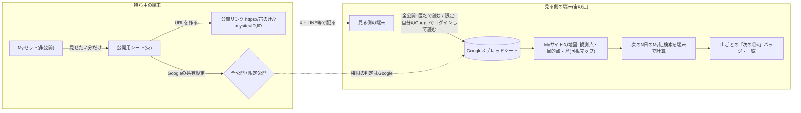
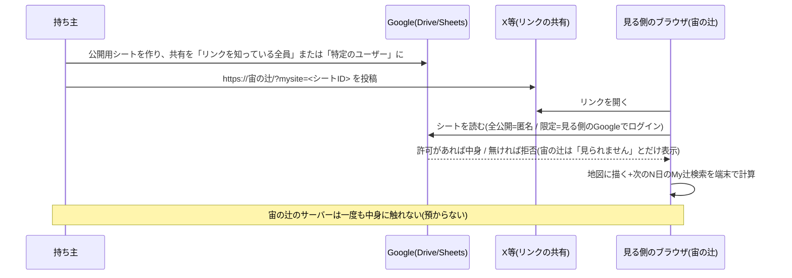

# デッサン（dessin）
-------------------------------------------------------------------------------
-------------------------------------------------------------------------------
## Myサイト
-------------------------------------------------------------------------------
-------------------------------------------------------------------------------

### まず一言で:
- Myサイトは、**「近いうちに、どの山で、いつ、どこから、推し辻(◎○)が見られるか」が日本地図で一目で分かり、他者と共有できる場所**です。

### 命名書:

- 名称: **Myサイト**
- 命名: たけちゃん(渡邊剛義・takeyosui)。2026-10-04。
- 由来(依頼者の言葉・3つ):
  1. 山だけでなくて、東京タワーなどの構造物もサポートしていたから。
  2. `site`と`sight`を掛けて、`サイト`。(推し辻が「見える(sight)」「場所(site)」)
  3. 「**Myサイト - 私の推し辻ダイヤモンド/推し辻パール/推し辻天の川の日時と場所が一目でわかるサイト**」というフレーズを使いやすいように、**推し辻**というワードを入れた。また、サイト名はユーザが任意名をつけられるようにシンプルに**My**にした。

### コンセプト

https://note.com/takeyosui/n/n302ed709d2c7

今朝、ベッドの中で、深い眠りから覚めたら、思うことがありました。
慌てて、スマホのメモにとったけれど、こんな感じでした。

どこに立ったら、何が見えるか、そして、そこから、いつ再び、何が見えるか、撮影者として、知りたいをかなえるツール。

例えば、ロケハンして、ステージが気に入ったけど、主役の天の川や月は、どう映るか、そして、いつ再び来れば良いか、を知ることができる。

大切なのは、立つ位置（客席）とロケーション（ステージ）と天体（主役）と時期（演目時間）という、演目。

辻検索は、立つ位置（客席）と山の場所（ステージ）を決めたら、いつ（演目時間）、何（主役）が見えるかを決めるためのツールでした。

辻メッシュ検索は、山の場所（ステージ）を決めたら、どの場所（客席）で、いつ（演目時間）、何（主役）が見えるかを決めるためのツールでした。

でも、正直、一つの演目（客席、ステージ、主役、演目時間）を決めるのは、私のような一般の人には難しいです。

私は、星景写真が一般の人にも楽しめるように、そして、一般の人の私でも、星景写真を楽しめるように、とツール開発をしてきました。

でも、気がついたのですが、写真家さんの知っている一つの星景写真という演目（客席、ステージ、主役、演目時間）には、価値があると。

そして、私は、写真でオリジナリティーを出したいわけではなくて、ああいう写真を私も撮ってみたいという、動機があるだけで、そういう一般の方達は、いっぱいると思いました。

そして、星景写真をもっと手軽に撮れるように普及してほしいと思いました。

その割に、星景写真を撮るためには、色々と敷居が高いです。

お金をかけて、高いカメラを買えば撮れるようになるものではありません。

なぜなら、演目（客席、ステージ、主役、演目時間）を知らないからです。

そして、演目を探すツールは、たくさんあります。

だから、私は、星景写真（演目）という、立つ位置（客席）とロケーション（ステージ）と天体（主役）と時期（演目時間）を知らない人と、知っている人を繋ぐツール、演目を知らない人と知っている人が行き交う（辻）ツールを作っていこうと思いました。

もう、その一歩は、踏み出しました。
宙の辻のMyサイトで、宙の辻の画面をサーバーレスで、全共有公開、限定共有公開、非公開が選べるものです。

限定共有公開があるのは、価値ある演目を提供していただける写真家さんを守るためです。

撮影地情報という価値ある演目を写真家さんたちが、 noteなどで、有料販売できるようにです。

星景写真（宙）という演目を知らない人と知っている人が行き交う（辻）ツール

これが、私の『宙の辻 - Sora no Tsuji』のコンセプトです。

### 検討資料(第155・依頼者の依頼): 「推し山サイト(SNS)」をやめて「Myサイト」へ — サーバー無しで、どこまでできるか

依頼者の問い(2026-10-03・原文の要旨): なりすましが防げないのでSNSはやめる。代わりに、複数のMyリストを集めた「私だけのMyサイト」を日本地図でぱっと見で分かるようにし、
公開/非公開を持ち、Googleスプレッドシートの共有状態(閲覧者限定/リンクを知っている全員)で判断し、全公開なら公開期間つきで宙の辻側にキャッシュして公開リンクをXなどで共有、
リンクを知っている人が同じものを見られるように。写真家が撮影地情報で収益を得られる強固で柔軟な認証も。パスフレーズよりGoogleアカウントの閲覧権限の方が安全では?
ただし、サーバー側は作り込みたくない(ユーザーの大切な情報を預かれる開発・スキル・責任は無い)。サーバー無しのローカル側で「私の推し辻リストが近々『辻』になる」が一発で分かれば十分かも。

#### まず結論(AIの提案)
1. **宙の辻側のキャッシュ(サーバー)は持たない。** 公開/限定公開の判断と鍵は、すべて**Googleの共有機能に委ねる**。宙の辻は「見る側のブラウザがGoogleから直接読んで描く」だけにする。
   これなら、宙の辻はユーザーの情報を一切預からない(依頼者の方針と一致)。
2. **Myサイト=「公開用のMyセット(シート)の束」を1枚の日本地図に描く画面。** 持ち主は、見せたいMyリストだけを「公開用シート」に集め(今のMyセットの同期の仕組みの延長)、
   その**シートのID(またはIDの束)をURLに入れた宙の辻のリンク**を配る。見る側は、そのリンクを開くと、宙の辻が(見る側のブラウザから)シートを読んで地図に描く。
3. **公開の範囲はGoogleの共有の設定そのもの**: 「リンクを知っている全員」=誰でも見られる(全公開)。「特定のユーザー」=そのGoogleアカウントでログインした人だけ(限定公開)。
   見る側の宙の辻は、全公開なら匿名で、限定公開なら**見る側自身のGoogleログイン**(OAuth)で読む。宙の辻は持ち主の鍵を持たない。
4. **公開期間**は2段で持つ: ①持ち主がシートの共有を外す(本物の遮断)。②シートに「公開終了日」のセルを置き、宙の辻はその日を過ぎたら描かない(見た目の遮断。クライアント側なので本物の壁ではない)。
5. **写真家の有料公開**は、サーバー無しでは「支払い→閲覧権限の付与」を**Googleの共有(特定のユーザーに追加)で手作業**にするのが、いちばん安全で現実的。
   パスフレーズ方式(ブラウザで復号)は実装できるが、鍵が漏れたら止められず、復号後のデータは複製できる。「強固」をうたえるのは**Googleアカウントの権限**の方。
6. **「近々『辻』になる」を一発で**: 見る側の宙の辻が、読んだMyリスト(観測点・目的点・My辻検索の条件)で**次のN日(初期値14日)のMy辻検索を自分の端末で走らせ**、
   日本地図に「山(目的点)ごとに次の◎○の日時」のバッジを立てる。計算は見る側の端末(今のMy辻検索そのもの)なので、サーバーは要らない。

#### 何がサーバー無しで「できる/できない」か
| 要件 | サーバー無しでできるか | どうやって | 限界 |
|---|---|---|---|
| 複数のMyリストを1枚の日本地図に | ○ | 公開用シートの束をURLで指定→見る側が読んで描く | — |
| 公開/非公開 | ○ | Googleの共有設定(リンクを知っている全員/特定のユーザー/非公開) | 宙の辻は設定を変えられない(持ち主がDriveで操作) |
| 限定公開(見る人を選ぶ) | ○ | 特定のGoogleアカウントに閲覧権限→見る側は自分のGoogleでログインして読む | 見る側にもGoogleアカウントが要る |
| 公開期間 | △ | シートの「公開終了日」(見た目の壁)+持ち主が共有を外す(本物の壁) | 宙の辻だけでは強制できない |
| 公開リンクをXなどで共有 | ○ | `https://(宙の辻)/?mysite=<シートID>` の形 | シートIDはURLに見える(限定公開なら見えても読めない) |
| 「リンクを知っている人が同じものを見る」 | ○ | 同じシートを同じ宙の辻で描くので同じ画面 | 見る側の端末の計算(My辻検索)なので数秒の待ち |
| 宙の辻側でのキャッシュ | × (持たない) | — | 持たないことが安全(預からない) |
| 有料公開(収益) | △ | 支払いは外部(noteの有料記事・BOOTH・Stripeのリンク等)→持ち主がGoogleの共有に相手を追加 | 自動化はサーバーが要る。手作業で小規模なら成り立つ |
| パスフレーズで閲覧 | △ | シートに暗号文(ブラウザでAES-GCMで復号)。鍵は別経路で渡す | 鍵が漏れたら止められない。復号後は複製できる。「強固」ではない |
| なりすまし防止 | ○(SNSより強い) | 投稿が無い。見せるのは持ち主のGoogleアカウントが共有したシートだけ | 持ち主の名乗り(表示名)はシートの中身=自己申告 |
| 偽公式・フィッシング | ○ | メッセージ機能を持たない(memoの方針)。リンクは宙の辻のドメイン直下 | 偽の宙の辻ドメインは防げない(どのサイトも同じ) |

#### 流れ(Mermaid)

#### 「公開用シート」の形(案)
- 今のMyセットの同期(Googleスプレッドシート)と同じ列に、先頭にメタの行を足す: `表示名`・`ひとこと`(100字)・`公開終了日`・`含めるMyリスト`(観測点/目的点/My辻検索)・`版`。
- 1枚のシートに1つのMyセット。複数のMyセットを束ねる時はURLに複数のIDを並べる(`?mysite=ID1,ID2`)か、「束のシート」(IDの一覧だけ)を1枚作る。
- 読む側は**読み取り専用**で開く(書き戻しの経路を持たない)。

#### 認証と鍵の整理(依頼者の問い「パスフレーズよりGoogleの閲覧権限の方が安全では?」への答え)
- **Googleアカウントの閲覧権限の方が安全です。** 理由: ①鍵の配布と失効がGoogle側(持ち主がいつでも外せる) ②見る側の本人確認がGoogle(2段階認証を含む) ③宙の辻は鍵を持たない。
- パスフレーズ方式は、鍵を配った後に止める手段が無く(新しい鍵で暗号化し直して配り直すしかない)、復号後のデータは複製できる。「強固」とは言えないので、採るとしても
  「全公開の中で少しだけ隠す」(例: 代表点の位置を粗くする)用途に留める。
- 「ある期間だけ公開し、後から期間を直せる」は、持ち主が**Googleの共有の期限付きアクセス**(Google Workspaceの機能。個人アカウントでは有効期限の設定が使えない場合がある)か、
  シートの`公開終了日`を書き換える(見た目の壁)で実現する。本物の壁は共有を外すこと。
- 有料化: 支払いの受け取りは宙の辻の外(noteの有料記事にシートIDと閲覧依頼の手順を書く・BOOTH・Stripeの支払いリンク等)。持ち主は支払った人のGoogleアカウントを共有に追加する。
  小規模(数十人)なら手作業で回る。大規模や自動化はサーバー(またはGoogle Apps Script=持ち主のGoogleアカウントで動く小さなサーバー)が要る。
  Apps Scriptは「持ち主の」Googleで動くので、宙の辻の運用者がリソースを管理する話にはならない(将来の選択肢)。

#### 宙の辻側に要る実装(見積もり。順番は依頼者の判断で)
1. URLの`mysite`パラメータ(シートIDの束)→公開用シートを読む(全公開=APIキー無しの「ウェブに公開」のCSV、または Sheets API+見る側のOAuth[今のMyセット同期の認証を流用])。
2. Myサイト画面: 日本全図に、観測点(青)・目的点(赤)・My辻検索の線・可視マップの島(資産があれば)を描く。持ち主の表示名・ひとこと・公開終了日。
3. 「近々の辻」: 読んだMy辻検索の条件で次のN日を端末で計算し、目的点ごとに「次の◎○」のバッジと一覧(日時・観測点・方位)。期間の初期値14日(ユーザーが指定可)。
4. 持ち主側: 「公開用シートを作る」ボタン(今のMyセットから見せたいリストを選んで新しいシートに書き出す)+「公開リンクを作る」(IDを束ねたURL。クリップボードへ)。
5. 守り: 読む側は読み取り専用・書き戻し無し。メッセージ機能無し。表示名はシートの値をそのまま(リンク化しない。外部URLは表示しない=第143の方針)。
6. 注記(公開文): 「このMyサイトは持ち主のGoogleスプレッドシートを、あなたのブラウザが直接読んで描いています。宙の辻はその内容を保存しません。」

#### 判断をお願いしたいこと
- Q1: Myサイトの「見る側」は、全公開ならGoogleログイン無しで見られる形でよいか(=シートを「ウェブに公開」する運用になる)。

はい、良いです。

- Q2: 限定公開は「見る側が自分のGoogleでログイン」でよいか(見る側にもGoogleアカウントが要る)。

はい、良いです。

- Q3: 有料公開は「支払いは外・権限の付与はGoogleの共有で手作業」の小規模運用で始めてよいか(自動化は作らない)。

はい、良いです。

- Q4: 「近々の辻」の期間の初期値(14日案)と、地図に出すもの(観測点・目的点・線・島・バッジ)の優先順。

画面構成の案なのですが、Myセットと同じように、既定のサイトがあり、既定のサイトには、複数のMyセットを関連づけられるようになっている。
そして、既定のサイト以外に、複数のMyサイトを持てるようになっている。
Myセットは、1つのスプレッドシートであるので、Myセットの公開非公開範囲は、Myセット単位である。
その公開されたMyセット単位で、複数のMyサイトに関連づけられる1対多の関係である。
そして、Myサイトも、Myセットと同じように、1つのスプレッドシートである。
Myサイトのスプレッドシートには、複数のシートがある。
シート①「Myセット」には、関連づける複数のMyセットのスプレッドシートの公開共有URLのリスト、Myセット単位の公開開始日付と公開終了日付、がある。
シート②「全体設定」には、Myサイト単位の公開開始日付と公開終了日付、150文字までのサイト名、推し辻検索期間
シート③「サイトバージョン」には、このサイトのシートの内容の版管理するバージョンと書き換え禁止の注意書き
できたら、Myサイトのスプレッドシートは、直接手で編集するのではなく、辻検索や辻メッシュ検索のように、リストを画面に表示して、チェックボックスで選択をするとか、日付ピッカーを行に埋め込んで、入力させるとか、サイト名も、テキストボックスを行に埋め込んで、入力をさせたいです。
そして、Myサイトを共有するときのURLは、`?mysite=ID1`で入力するID1は、公開するMyサイトのスプレッドシートの公開の共有URLを指定するだけにしたいです。
そして、できたら、`?mysite=ID1,ID2`として、複数のMyサイトを合わせて表示したり、公開前にプレビューしたり、公開されているMyサイトのURLから自分のMyサイトに取り込めたりできるようにしたいです。
ということは、MyセットやMy辻検索やMy観測点/目的点/天体は、辻検索や辻メッシュ検索のようにリスト表示のエディターが今後表示されるようになれば良いですね。
でも、多分できますね。
どれも、CSVで書き出し可能なフォーマットなので😄
いかがでしょうか。
